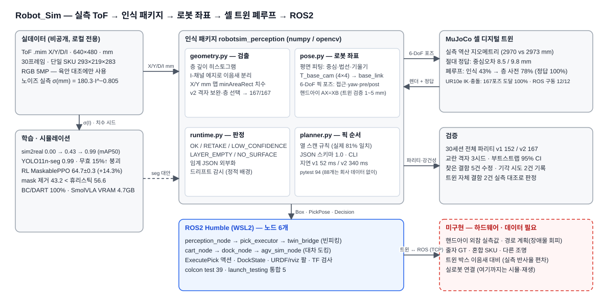
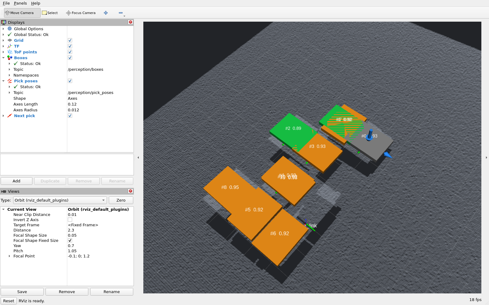
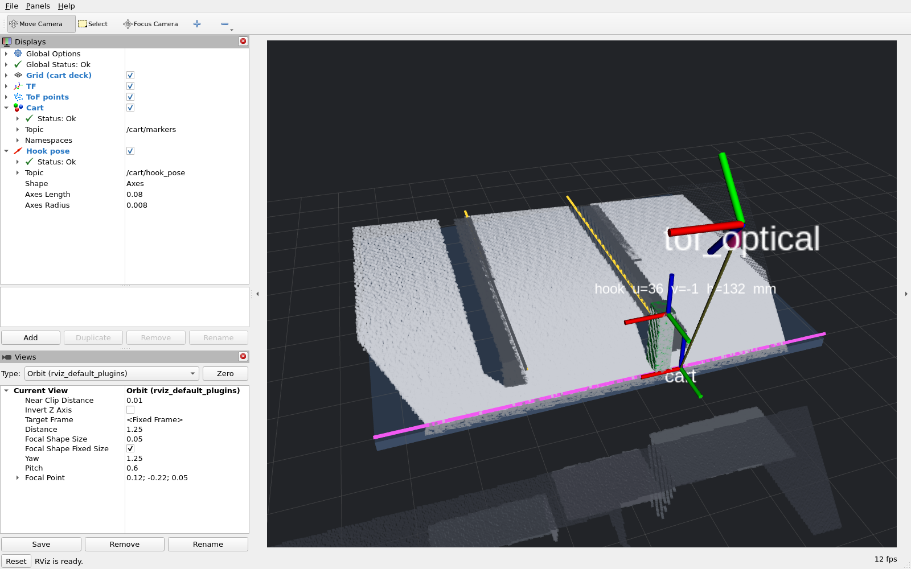
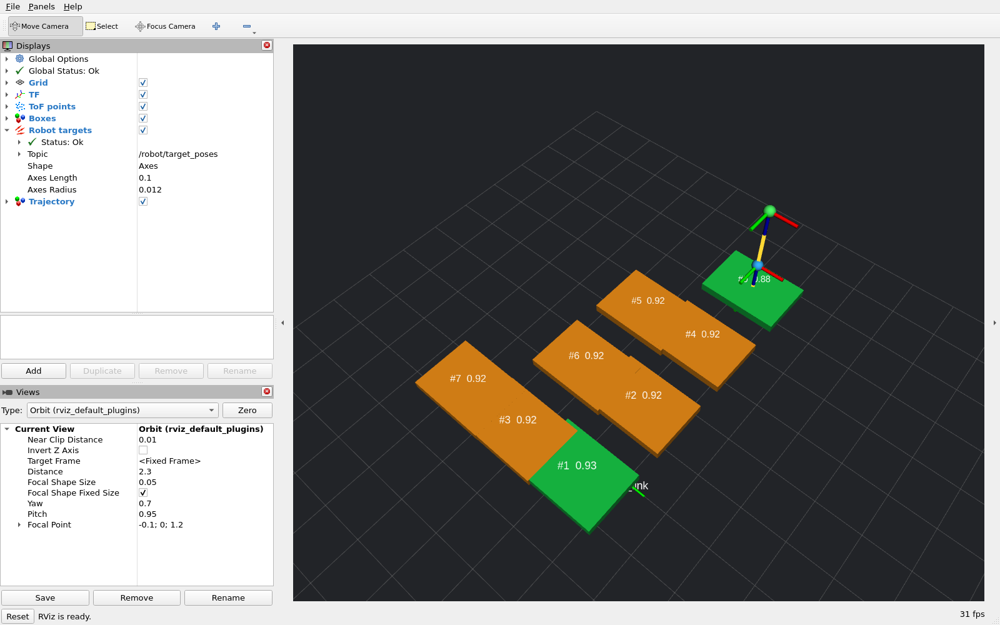

# Robot_Sim — 실측 ToF 기반 로봇 인식 · 좌표 변환 · 셀 트윈 폐루프

산업 물류 현장의 RGB+ToF 실측 데이터(30프레임, 단일 SKU)로 **박스 검출 → mm 치수 → 로봇 베이스 좌표 6-DoF 픽 포즈 →
MuJoCo 셀 트윈에서 인식 출력만으로 집어 옮기는 폐루프 → ROS2 노드/rviz2** 까지 만들고, 절대 정답·교란 격자·전 세션
파리티 테스트로 검증한 개인 프로젝트. 환경: RTX 3080 10GB ×2, Windows 11 + WSL2. 실로봇 없음.
원본 데이터는 비공개이며 집계 수치와 depth 시각화만 공개한다(`docs/03`).



*편집용 원본: [`docs/diagrams/architecture.excalidraw`](docs/diagrams/architecture.excalidraw) · 생성: `python tools/make_architecture_diagram.py`*

## 핵심 수치

| 항목 | 결과 | 근거 |
|---|---|---|
| 박스 검출 (실측 30프레임, RGB 대조 검증 167개) | v1 152 → **v2 167/167**, 빈 프레임 오검출 0, 340 ms | [상세 §1](docs/30_결과_상세.md#1-tof-기반-박스-검출치수-측정) · `results/detector_robustness.json` |
| 치수 · 픽포인트 | L 292.3±8.0 / W 217.7±7.6 mm · 기울기 0.95° · 평면 RMS 5.4 mm | 상세 §1 |
| 절대 정확도 (셀 트윈, 48장면) | 중심오차 **8.5 mm**(클린) / 9.8 mm(노이즈), 깊이 오차 0.0, 잔여 ≥4개 정밀도 0.95 | [상세 §8](docs/30_결과_상세.md#8-셀-디지털-트윈--절대-정답-기반-검증-mujoco) · `results/twin_detect_accuracy.json` |
| 인식→제어 폐루프 (트윈, 60회, 같은 장면) | mocap 석션: oracle **100%** vs 인식 구동 **46.7%** (인식 비용 53.3%p, 11.7 s/픽) · UR10e 가 실제로 움직이면 oracle 85~88% vs 인식 60% (25~28 %p, 7.9~8.6 s) | [상세 §9](docs/30_결과_상세.md#9-인식--제어-폐루프-셀-트윈에서-실제로-집어-옮기기) · §10 · `results/twin_closed_loop*.json` |
| 팔 도달·충돌 (UR10e, 트윈) | 실측 픽 포즈 167개: 고정 받침대 도달 87% → **리니어 트랙 100%**, 하강 무충돌 98%, 접근 무충돌 96%, 순수 이동 3.1 s/픽 | [상세 §10](docs/30_결과_상세.md#10-팔-도달충돌사이클--ur10e-를-트윈에-세우다) · `results/twin_arm_reach.json` |
| 강건성 (교란 격자, 3시드) | 대면적 결손 30개에서 위치 일치 리콜 v1 57% → v2 74% | 상세 §하단 표 · `results/detector_robustness.json` |
| ToF 노이즈 모델 | σ(mm) = 180.3 · I^−0.805 (정적 픽셀 12.7만) | [상세 §2](docs/30_결과_상세.md#2-tof-깊이-노이즈-특성-분석) |
| 대차 후크 반복성 | 데크 ICP 정렬로 22.7 → **3.2 mm** | [상세 §7](docs/30_결과_상세.md#7-대차-후크-위치-반복성-3d-정합) |
| sim2real / 학습 세그 | 합성 전용 0.00 → 노이즈 시뮬 0.43 → +실측 6장 0.99 · seg mAP50 0.99(무효 15%↑ 붕괴) | [상세 §4](docs/30_결과_상세.md#4-합성데이터-sim2real) · §6 |
| 팔레타이징 RL (3시드) | MaskablePPO 64.7±0.3 vs 휴리스틱 56.6 (+14.3%) · mask 제거 43.2 | [상세 §3](docs/30_결과_상세.md#3-팔레타이징-강화학습) · `results/palletize_multiseed.json` |
| 모방학습 · VLA | DART BC 100% (가상 Franka) · SmolVLA 파인튜닝 VRAM 4.7 GB | [상세 §5](docs/30_결과_상세.md#5-가상환경-제어모방학습-mujoco-franka) |
| 테스트 | pytest **51** (46개는 합성 프레임만으로) · 30세션 전체 파리티 v1/v2 · 대차 4세션 파리티 · colcon test 25 | `tests/` · `ros2_ws/.../test/` |

## 구성

| 영역 | 무엇 | 어디 |
|---|---|---|
| 인식 패키지 | 검출(geometry) · 로봇 좌표/6-DoF 포즈(pose) · 판정 상태·드리프트(runtime) · 픽 순서(planner) · CLI/JSON | [`robotsim_perception/`](robotsim_perception/) · [docs/40](docs/40_패키지_사용법.md) |
| ROS2 (Humble, WSL2) | 노드 3개 — `perception_node`(빈피킹: PoseArray base_link · 정적 TF) · `cart_node`(대차: 동적 TF tof_optical→cart · 도킹 목표 포즈) · `pick_executor`(3점 로봇 명령 · 재촬영 서비스 호출로 사이클 닫음) · rviz2 · colcon test 25 | [`ros2_ws/`](ros2_ws/src/) · [docs/42](docs/42_ROS2_핸즈온.md) |
| 셀 디지털 트윈 | 실측 역산 지오메트리 MJCF · 절대 정답 평가 · 인식 구동 픽/플레이스 폐루프 · UR10e 팔(IK·충돌·관절 속도) 도달 분석 | [`sim/`](sim/) · [docs/41](docs/41_셀_트윈.md) |
| 학습 · 시뮬 | BlenderProc/Isaac SDG · YOLO det/seg · MaskablePPO · BC/DART · SmolVLA · 로컬 VLM | [`tools/`](tools/) |
| 검증 · 재현 | 교란 벤치 · 트윈 평가 · 전 세션 파리티 · 집계 JSON 공개 | [`tests/`](tests/) · [`results/`](results/) · [docs/21 실험로그](docs/21_실험로그.md) |

### ROS2 (Humble, WSL2)

`perception_node` 가 합성 소스(회사 데이터 불필요)로 돌며 `/tof/points`·`/perception/boxes`·`/perception/pick_poses`(base_link)·
`/perception/status`·`/diagnostics`·TF 를 내고 `~/capture`(Trigger) 로 PLC 트리거 사이클을 흉내 낸다. 헤드리스 rviz2 캡처:



*화면 설명: 회색 점은 ToF 점구름, 초록 판은 직접 검출한 박스 윗면, 주황 판은 격자 규칙으로 채운 칸, 회색 판은 신뢰도가 낮아 픽 계획에서 뺀 박스다.
판 위의 작은 축은 로봇이 집을 위치와 자세(로봇 기준 좌표), 파란 화살표는 다음에 집을 박스로 들어가는 방향이다.
빌드·실행 방법, 명령줄로 그래프를 살펴보는 법, 제어 노드 실습(6절)은 [docs/42](docs/42_ROS2_핸즈온.md)에 있다. WSL2 에서 겪은 DDS 공유메모리·시계 점프 문제와 해법도 거기에.*

두 번째 노드 `cart_node` 는 **대차 견인 고리** 데이터용이다. 카메라가 데크를 약 40° 비스듬히 보므로 탑다운 가정 대신
데크 플레이트 평면·림·레일에서 **대차 좌표계를 매 프레임 추정**해 동적 TF(`tof_optical → cart`)와
`/cart/hook_pose`(위치 = 고리, 자세 = 대차 축)를 낸다. 합성 소스는 카메라 높이 400~462 mm 를 바꿔 가며
"카메라 좌표는 변해도 대차 좌표는 같다"를 보여 준다. 실측 4세션에서 이 구조 프레임의 고리 반복성은 **3.85 mm RMS**(면내 3.1 mm)이고,
위 표의 3.2 mm 는 여기에 데크 ICP 정련을 더한 오프라인 수치다(노드는 ICP 없이 돈다):



*화면 설명: 고정 프레임이 대차라 데크가 수평으로 보인다. 파란 판이 데크 평면, 자홍 선이 데크 앞 테두리(림, 대차 좌표의 v'=0),
노란 선이 레일 안쪽 벽(u'=0 과 u'=레일 간격), 초록 기둥이 고리, 위쪽의 축이 카메라 위치다. 카메라 높이가 바뀌어도 고리는 대차 좌표에서 같은 자리에 잡힌다.*

세 번째 노드 `pick_executor` 는 인식 결과를 **받는 쪽**이다. 픽 포즈를 pre-pick, pick, lift 세 점의 로봇 명령으로 바꿔
`/robot/target_poses` 로 내고, 실행이 끝나면 인식 노드의 촬영 서비스를 호출해 다음 프레임을 받는다. 합성 12박스 장면을
12사이클(2.4 초 간격)로 전부 집고 소스가 비면 스스로 멈춘다. 중간에 검출기가 두 번 "층이 비었다"고 했지만 재촬영으로 넘겼다.
판단 로직은 ROS 없이 pytest 로 검사한다.



*화면 설명: 픽 네 개를 집은 뒤의 장면. 남은 박스 여덟 개 가운데 초록은 직접 검출, 주황은 격자 규칙으로 채운 칸이다. 오른쪽 위 박스 위의
노란 선이 pre-pick(파란 점), pick(빨간 점), lift(초록 점) 세 점의 궤적이고, 보이는 두 축은 lift 와 pre-pick 자세다(pick 자세의 축은 박스 판 아래).
노드 그래프와 실행 기록은 [docs/42 6절](docs/42_ROS2_핸즈온.md)에 있다.*

## 한계 (읽고 수치를 쓸 것)

- 단일 SKU · 단일 카메라 포즈 · 연속 시퀀스 30프레임(레이아웃 2종). 다른 조명·손상·혼합 SKU 미검증
- 실측 정답은 검출기 출력 + RGB 육안 대조(pseudo-GT). 절대 오차는 트윈에서만 측정
- 폐루프의 팔 실행기는 IK·충돌 검사·관절 속도까지만 본다 — 장애물을 돌아가는 경로 계획과 석션 물리는 없음. 절대값이 아니라 **oracle 대비 인식 비용**이 결과
- **미해결**: 가득 찬 아래층 위에 박스가 1~3개만 남으면 층 선택이 아래층으로 점프(정밀도 0.07~0.14). 시도 2건 기각·기록
- 실로봇·센서 드라이버·핸드아이 외참 실측값·줄자 GT 없음 → 이 항목들은 하드웨어가 있어야 닫힌다

전문: [docs/30 결과 상세 → 실용성 검증과 한계](docs/30_결과_상세.md#실용성-검증과-한계-정직한-평가)

## 문서

| 파일 | 내용 |
|---|---|
| [docs/30_결과_상세.md](docs/30_결과_상세.md) | 결과 1~10절 전문 + 한계 + 역량 매핑 |
| [docs/40_패키지_사용법.md](docs/40_패키지_사용법.md) | 인식 패키지 CLI·API·JSON 스키마·테스트 |
| [docs/41_셀_트윈.md](docs/41_셀_트윈.md) | 트윈 구성 · 찾은 결함 · **검증하지 않는 것** |
| [docs/42_ROS2_핸즈온.md](docs/42_ROS2_핸즈온.md) | ROS2 빌드·실행·CLI 탐색·실습 과제 |
| [docs/21_실험로그.md](docs/21_실험로그.md) | 실험 58건 시간순 (기각한 시도 포함) |
| [docs/ARCHITECTURE.md](docs/ARCHITECTURE.md) | 다이어그램 + 검출 파이프라인 상세 |
| [docs/00](docs/00_하드웨어_판정.md) · [02](docs/02_환경_셋업.md) · [03](docs/03_공개전략_및_데이터보안.md) | 하드웨어 판정 · 환경 셋업 · 데이터 보안 정책 |
| [results/](results/) | README 수치의 원본 JSON 13종 (세션 ID 익명화) |

## 빠른 시작

```powershell
E:\Robot_Sim\.venv\Scripts\Activate.ps1
pip install -r requirements.txt --extra-index-url https://download.pytorch.org/whl/cu126
python -m pytest tests -q                                          # 51 passed (실측 데이터 없으면 5건 skip, 46 passed)
python -m robotsim_perception run <session_dir> --lattice --json out.json --overlay out.png
.venv\Scripts\python.exe tools/twin_detect_eval.py --scenes 24   # 트윈 절대 정확도
.venv\Scripts\python.exe tools/twin_closed_loop.py --episodes 10  # 폐루프
```

ROS2 (WSL2): `docs/42_ROS2_핸즈온.md` — `scripts/wsl_install_ros2.sh` 로 Humble 설치 후 `colcon build`, `ros2 launch robotsim_perception_ros perception.launch.py`.

`requirements.txt` 는 이 머신에서 검증된 버전 조합이다 — torch 2.9~2.11 과 mujoco 3.2.7+ 는 Windows 26200 에서
DLL 초기화 실패(WinError 1114) 하므로 torch 2.8.0+cu126 / mujoco 3.1.6 으로 고정돼 있다.
