# Robot_Sim — 물류 로봇 인식·강화학습 파이프라인

산업 물류 현장의 RGB+ToF 실측 데이터를 기반으로 **3D 인식 → 센서 모델링 → 시뮬레이션·강화학습 → 인식-정책 통합**까지
엔드투엔드로 구축한 개인 연구 프로젝트. 모든 수치는 실측·재현 가능한 실험 결과이며,
데이터 보안 원칙(`docs/03`)에 따라 원본 데이터는 비공개, 집계 결과와 depth 시각화만 공개한다.

## 환경

- RTX 3080 10GB ×2 (Ampere, NVLink 없음 — VRAM 풀링 불가)
- Windows 11 + WSL2 / Anaconda Python 3.12.4 (`D:\anaconda`)
- 데이터 자산: 실공장 대차 적재 RGB+ToF 이미지 (회사 데이터 — 외부 공개 금지)

## 문서

| 파일 | 내용 |
|---|---|
| [docs/01_무료_데스크탑_로드맵.md](docs/01_무료_데스크탑_로드맵.md) | **메인 로드맵** — 무료 트랙 T1~T8, 타임라인, 금지 목록 |
| [docs/00_하드웨어_판정.md](docs/00_하드웨어_판정.md) | 10GB에서 되는 것/안 되는 것 (공식 문서 검증값) |
| [docs/02_환경_셋업.md](docs/02_환경_셋업.md) | Windows/WSL2/Isaac Sim 4.5 설치 절차 |
| [docs/03_공개전략_및_데이터보안.md](docs/03_공개전략_및_데이터보안.md) | ⚠️ 공장 데이터 취급 원칙 + 공개 채널 전략 |
| [docs/40_패키지_사용법.md](docs/40_패키지_사용법.md) | `robotsim_perception` 패키지 — CLI·API·JSON 스키마·테스트·알려진 한계 |
| [results/](results/) | **README 수치의 원본 JSON** (익명화된 집계 결과 12종) |
| [docs/research/](docs/research/) | 8개 도메인 리서치 원본 + 검증 리포트 (출처 링크 포함) |

## 프로젝트 구성

| 영역 | 내용 | 상태 |
|---|---|---|
| **3D 인식** | ToF 단독 박스 검출(v1 148 → v2 167/167, RGB 대조 검증)·mm 치수·픽포인트·픽 순서 복원 · 순수 numpy/opencv 패키지(pytest 27) | ✅ 완료 |
| **센서 모델링** | ToF 노이즈 실측 모델 σ(I) — 합성데이터 캘리브레이션 근거 | ✅ 완료 |
| **강화학습** | 실측 치수 기반 팔레타이징 환경 구축 + MaskablePPO (휴리스틱 +14.7%) | ✅ 완료 |
| **인식-정책 통합** | 실장면 상태 이식 → 최소동선 PICK / 목적지 PLACE 제안 (실제 순서로 검증) | ✅ 완료 |
| **합성데이터·sim2real** | 합성 전용 0.00 → 센서특성 시뮬 0.43 → +실측 6장 0.99 · Isaac Replicator 0.56 vs BlenderProc 0.43 | ✅ 완료 |
| **학습 세그멘테이션** | YOLO11n-seg(합성 BP+Isaac + 실측 6장) 실측 홀드아웃 mAP50 0.99, GPU 22 ms — 무효 픽셀 15% 이상에서 붕괴하는 한계 실측 | ✅ 완료 |
| **3D 정합·반복성** | 대차 후크 위치: 데크(고정 구조물) ICP 정렬로 4세션 반복성 RMS 22.7 → 3.2 mm | ✅ 완료 |
| **로봇 학습 인프라** | LeRobot 파이프라인, SmolVLA-450M 파인튜닝 자원 실측 (VRAM 4.7GB/10GB) | ✅ 완료 |
| **가상환경 제어·모방학습** | PushT Diffusion 스윕(성공률 38%) · 전문가 데모→DART→BC 100% (가상 Franka) | ✅ 완료 |
| **VLM 에이전트** | 로컬 Qwen2.5-VL-3B: 장면 그라운딩 → 인식 도구 결과 주입 → 액션 계획 JSON (3/3 정확) | ✅ 완료 |

## 역량 매핑 (채용 요건 → 증거)

| 요구 역량 | 이 프로젝트의 증거 | 상세 |
|---|---|---|
| 강화학습 환경 구축 | 실측 치수 시드 팔레타이징 환경 직접 설계(높이맵 + 지지율 제약 + action mask, **물리엔진 아님**) → PPO가 휴리스틱 +14.7% | [tools/palletize_env.py](tools/palletize_env.py) |
| 물리엔진 시뮬레이션 | BlenderProc·Isaac Sim 물리 드롭으로 합성데이터 생성, MuJoCo Franka 모방학습 — **적재 안정성 물리 검증은 미구현** | [tools/sdg_boxdrop.py](tools/sdg_boxdrop.py) |
| 로봇 비전 무교시(teaching-less) | 라벨 0장으로 픽포인트(중심+법선) 자동 생성, 기울기 0.95° | [tools/binpick_pickpoints.py](tools/binpick_pickpoints.py) |
| 3D 포인트클라우드 정합 | 대차 데크 ICP 로 대차 실이동(21~52 mm) 제거 → 후크 위치 반복성 3.2 mm (전체 장면 ICP 17.6 mm 의 오류 원인 규명) | [tools/hook_analysis_v2.py](tools/hook_analysis_v2.py) |
| AI 비전 ↔ 로봇 제어 연동 | 셀 트윈에서 **인식 출력만으로 집어 옮기는 폐루프** 성공률 56.7% (정답 포즈 oracle 96.7%) | [tools/twin_closed_loop.py](tools/twin_closed_loop.py) |
| 로봇 좌표계·파지 자세 | `T_base_cam` 변환 + 6-DoF 픽 포즈(요 포함) + 석션 풋프린트 판정 | [robotsim_perception/pose.py](robotsim_perception/pose.py) |
| 픽 순서 최적화 | 인식 상태 → 열 스캔 규칙, 실제 작업 순서와 81% 일치 | [tools/pick_next.py](tools/pick_next.py) |
| 합성 데이터 생성 · sim2real | 합성 전용 0.00 → 센서특성 시뮬 0.43 → +실측 6장 0.99 (실측 홀드아웃 mAP50) | [tools/sdg_boxdrop.py](tools/sdg_boxdrop.py) |
| 로봇 Foundation 모델 응용 | SmolVLA-450M 파인튜닝 자원 실측 (VRAM 4.7GB/10GB, 2h06m) | [docs/21_실험로그.md](docs/21_실험로그.md) |
| LLM/VLM 에이전트 | 로컬 VLM이 depth 장면을 이해하고 인식 도구 결과로 픽 액션을 결정 (그라운딩 100%, VRAM 7.3GB) | [tools/vlm_agent_demo.py](tools/vlm_agent_demo.py) |

## 아키텍처

전체 파이프라인 다이어그램(데이터→인식→RL→통합데모, Mermaid 렌더링): **[docs/ARCHITECTURE.md](docs/ARCHITECTURE.md)**
· 편집용 손그림 소스: [docs/diagrams/pipeline.excalidraw](docs/diagrams/pipeline.excalidraw)

## 결과 하이라이트 (실측 데이터 기반, 집계 수치만 공개)

> 산업 현장 고정 카메라의 RGB + ToF(X/Y/D/I, 640×480, mm) 데이터를 분석. 원본은 비공개(회사 데이터).

### 1. ToF 기반 박스 검출·치수 측정

깊이 히스토그램 층 검출과 강도(I) 채널 에지 분리로 박스를 검출한다 (라벨·학습 없음). v1 은 30세션에서 152개를 검출하고,
30프레임을 RGB(비공개, 로컬 대조)로 전수 확인한 실제 박스 수는 **167개**다. v2 가 167/167 을 회수한다.

- 상면 치수 **L = 292.3±8.0mm, W = 217.7±7.6mm** (167박스; v1 148박스 기준 293.0±9.2 / 218.8±9.9), 층간 깊이차로 박스 높이 283mm 도출
- 평면 피팅 픽포인트: 기울기 평균 0.95°(최대 2.7°), 평면 RMS 5.4mm
- 슬롯 추적으로 픽킹 순서 자동 복원 (두 층 모두 12개 → 세션당 1픽, 우측 열이 마지막)
- **v1 누락 15개의 원인**: 2층 4×3 격자 중앙 2개가 강도 에지 절단 실패로 병합(7프레임), 층 말미 잔여 박스 1~2개가
  중앙 ROI 히스토그램 피크의 바닥/티어시트 전환으로 누락(4프레임 6박스). 병합된 3건은 과대 치수(350×294mm)로
  검출되어 SKU 신뢰도 0.62 로 표시된다 — 로봇이 두 박스 사이를 흡착하지 않도록 걸러내야 하는 케이스
- **v2** (`detect_boxes_v2`): 신뢰 박스들로 격자(방향·치수·피치)를 추정해 상면 지지도 ≥ 0.3·모순 픽셀 ≤ 8% 인 셀을 보완하고,
  신뢰 박스가 0개면 질량 상위 8개 피크 층을 재시도 → **167/167, 빈 크레이트·빈 팔레트·티어시트 프레임 오검출 0, 226 ms/프레임**

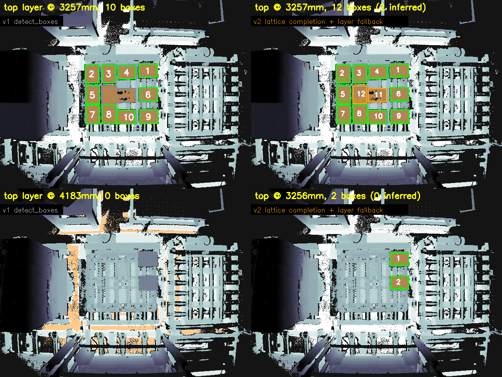

*(위: 2층 중앙 2박스 병합 → 격자 보완 / 아래: 잔여 2박스가 바닥 피크에 밀림 → 층 재시도. depth 시각화만 공개)*


### 1.5 인식 → 정책 연동 데모

검출 결과를 정책 입력으로 연결해 다음 픽 대상을 제안. 실제 픽 순서 마이닝으로 열 스캔 규칙을 도출해 일치율 50%→81%:

| 상면 검출 + mm 치수 | 픽포인트(십자) + 기울기 | 최소 동선 픽 제안 | 대차 후크 검출 |
|---|---|---|---|
|  |  | 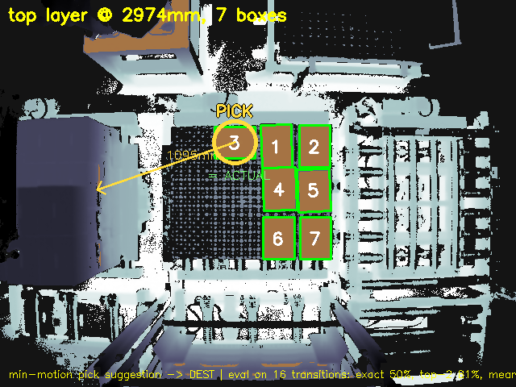 |  |

*(depth 기반 시각화만 공개 — RGB 원본은 비공개 원칙 유지)*

### 2. ToF 깊이 노이즈 특성 분석

30세션에서 정적 픽셀 12.7만 개를 자동 선별해 시간적 노이즈 실측:

- σ-거리 관계는 비단조, σ-강도 관계는 로그-로그 선형: **σ(mm) = 180.3 × I^(-0.805)**
- 거리 기반 표준 노이즈 모델 대신 강도 기반 모델이 이 센서에 적합함을 확인
- 활용: 합성 데이터(sim2real)의 depth 노이즈 주입을 실측 σ(I)로 캘리브레이션


### 3. 팔레타이징 강화학습

1100×1100mm(T-11) heightmap 환경, 지지율 제약 + action mask 내장 (`tools/palletize_env.py`):

- DBL 휴리스틱 베이스라인: **56.6±4.1박스, 활용률 59.8%** (max 120박스, 100 에피소드)
- **MaskablePPO (1.5M 스텝): 64.9박스, 활용률 68.5%±0.6%** — 동일 시드 100 에피소드 공정 평가에서 **휴리스틱 대비 +14.7% 박스, +8.7%p 활용률, 분산 대폭 감소**


같은 시드(68)에서의 최종 적재 비교 — PPO 65박스 vs DBL 56박스:

| MaskablePPO | DBL 휴리스틱 |
|---|---|
|  |  |

### 4. 합성데이터 sim2real

물리 시뮬(BlenderProc)로 실측 지오메트리를 재현(상면 깊이 오차 9mm)해 300씬 자동 라벨 생성.
합성 전용 학습 검출기를 실측 ToF 홀드아웃으로 평가:

| 학습 데이터 | 실측 mAP@50 |
|---|---|
| 합성 (clean) | 0.000 |
| 합성 + 실측 센서특성 시뮬(σ(I) 노이즈·무효픽셀) | 0.428 |
| 위 + 실측 6장 co-training | **0.988** |

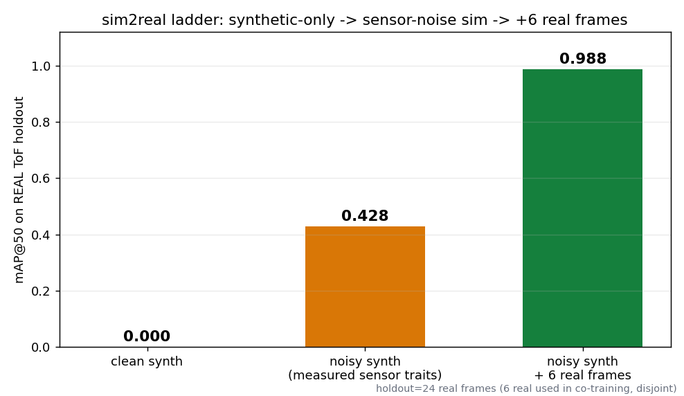

정답 라벨 재검증: 위 표의 실측 정답은 v1 검출기 출력(148박스)이며 실제 박스 167개 중 19개(11%)가 배경으로 라벨돼 있었다.
v2 정답(홀드아웃 24장 115 → 128박스)으로 재평가하면 co-training 검출기 mAP50 0.988 → 0.983, **정밀도 0.949 → 0.998**, 리콜 1.000 → 0.945 —
기존 '오검출'은 v1 이 놓친 실박스였다. 합성 전용 모델은 0.43 → 0.48(BlenderProc), 0.56 → 0.57(Isaac) (`tools/reeval_v2_gt.py`).

SDG 툴 비교 — 같은 실측 조건·노이즈 레시피로 Isaac Sim 4.5 Replicator와 BlenderProc을 각각 300프레임 생성해 동일 홀드아웃 평가:

| 툴 | 실측 mAP@50 | 비고 |
|---|---|---|
| BlenderProc 2.8 | 0.428 | 물리 드롭, Cycles |
| Isaac Sim 4.5 Replicator | **0.555** | 정치 배치, RTX 레이트레이싱 |

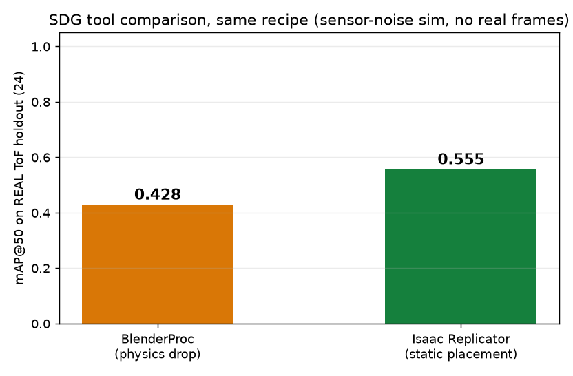
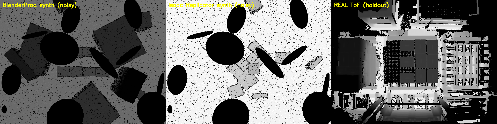

### 5. 가상환경 제어·모방학습 (MuJoCo Franka)

- 순수 SAC(sparse/dense)는 파지 미완성(성공률 0) → 스크립티드 전문가(100%) 데모 수집
- 완벽 데모 BC = 0% (covariate shift) → **DART 노이즈 주입 복구 데이터로 BC 100%** (20 데모)
- PushT Diffusion 263M: 체크포인트 스윕 성공률 38%, 커버리지 85~90% (50 eps × 6 ckpt)

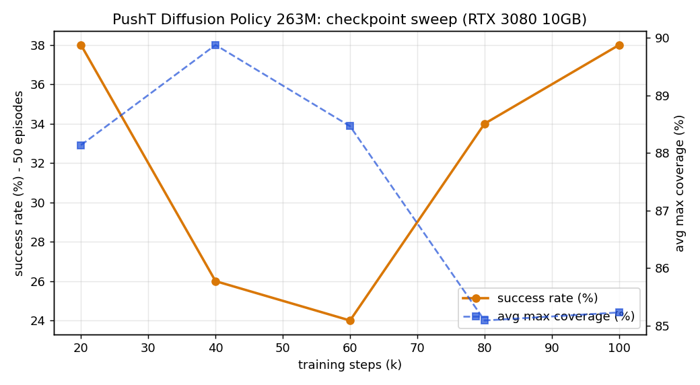

### 6. 학습 세그멘테이션 vs 기하 검출

- YOLO11n-seg: 합성(BlenderProc 276 + Isaac 276, 실측 ToF 노이즈 레시피) + 실측 6장 co-training, 60 epoch
- 실측 홀드아웃 24장: box/mask mAP50 **0.978**(v1 정답) → **0.991**(v2 정답, 정밀도 1.00) · GPU 21.9 ms / CPU 44 ms
- 열화 비교(기하 v1 대비 리콜): 깊이 노이즈 20mm 0.99 vs 0.90, 무효 블롭 30개 0.76 vs 0.66 — 학습 모델 우세
- **붕괴 모드**: 추가 무효 픽셀 15% 이상에서 리콜 0.00 (기하 0.99). 5×5 미디언 전처리로 15% 는 0.96 복구, 30% 는 0.40 —
  학습 분포 밖 무효 픽셀 밀도에 취약. 스펙클 증강이 다음 단계

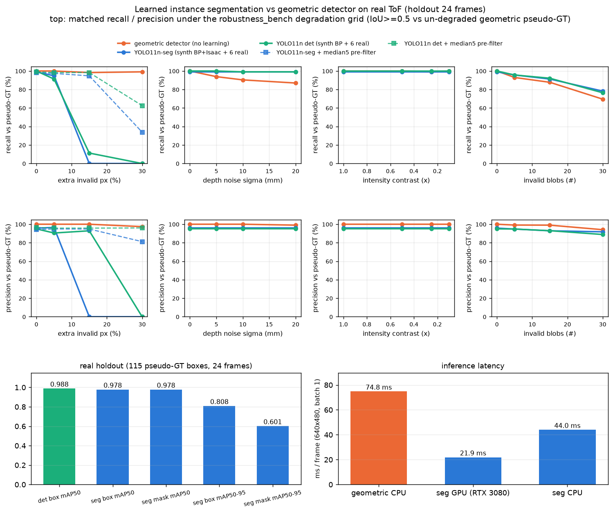

### 7. 대차 후크 위치 반복성 (3D 정합)

- 4세션 후크 중심 RMS: raw 22.7mm → 전체 장면 ICP 17.6mm → **대차 데크(고정 구조물) ICP 2.9~3.2mm**, 면내 1.8mm
- 이전 '25mm 바이어스'는 대차 자체의 실이동(21~52mm)을 전체 장면 ICP 가 흡수하지 못한 정렬 오류 — 센서 반복성 문제가 아니었다
- 강도 분할 벽면 추정기(v2)는 v1 클러스터 중심과 동급(3D 3.16 vs 2.90mm, 면내 1.84 vs 2.46mm) — 지배 요인은 추정기가 아니라 정렬 기준

| 후크 추정기 마커 (ToF 강도 채널 위) | 정렬 방식별 후크 중심 산포 |
|---|---|
| 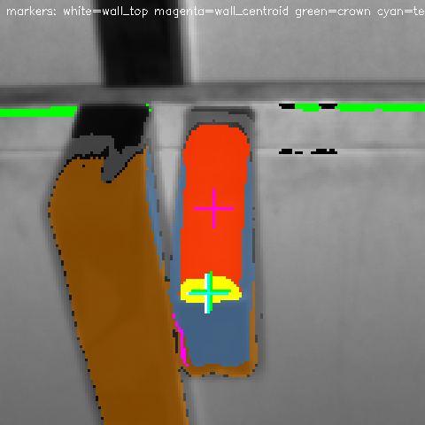 | 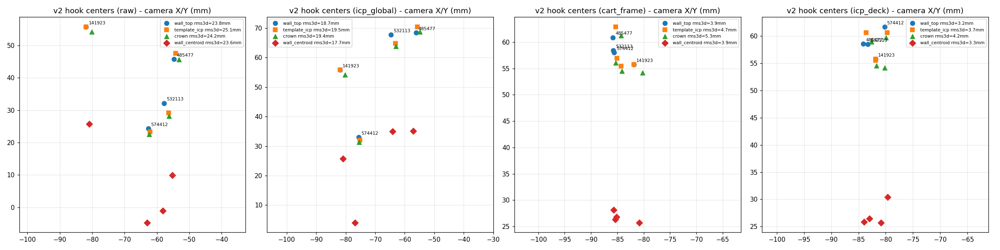 |

### 8. 셀 디지털 트윈 — 절대 정답 기반 검증 (MuJoCo)

실측 30프레임 평가의 근본 한계는 **정답이 검출기 자신의 출력**(pseudo-GT)이라 위치·치수 오차가 정의상 0이고
회귀를 잡을 수 없다는 점이었다. 실측 지오메트리를 그대로 옮긴 MuJoCo 셀 트윈에서는 박스의 실제 위치·자세를
`mjData` 에서 직접 읽으므로 **처음으로 절대 오차를 측정**할 수 있다.

트윈 구성 (`sim/cell_scene.py`): 카메라 바닥 위 4.183 m · f=517 px(fovy 49.8°) · 데크 0.643 m · 박스 293×219×283 mm ·
격자 피치 300×225 mm — 전부 실측 30프레임에서 역산한 값. 렌더 깊이의 상면이 2970 mm 로 실측 2973 mm 와 일치한다.
강도(I)는 실측에서 확인한 `I·D²≈3527` (능동조명 1/D² 감쇠)로, 노이즈는 실측 σ(I)=180.3·I^-0.805 + 결손 구조로 모델링.

48장면(잔여 1~12개 × 1~2층 × 클린/노이즈) 절대 정답 평가:

| 지표 | 클린 | ToF 노이즈 |
|---|---|---|
| 픽 중심 오차 (평균, 95% CI) | **7.6 mm** [6.1, 9.3] | **10.4 mm** [8.3, 12.8] |
| 픽 중심 오차 p95 | 17.8 mm | 40.7 mm |
| 치수 바이어스 L / W | −8.6 / −7.0 mm | −15.6 / −14.0 mm |
| 각도 오차 | 4.3° | 5.5° |
| 깊이 오차 | +0.0 mm | +0.0 mm |
| 리콜 / 정밀도 (잔여 ≥4개) | 0.86 / 0.72 | 0.80 / 0.75 |
| 리콜 / 정밀도 (잔여 ≤3개) | **0.50 / 0.15** | **0.60 / 0.18** |

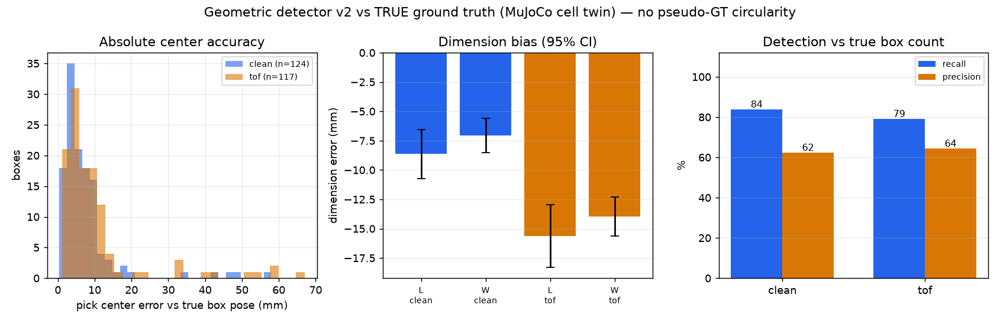

**트윈이 찾아낸 결함 3건** (실측 30프레임으로는 드러나지 않던 것):

1. **센티넬 오염 버그** — `MORPH_CLOSE` 가 무효 픽셀 구멍을 메우면 그 픽셀의 X/Y 센티넬(8191.75)이
   `minAreaRect` 에 섞여 13 m 짜리 사각형이 나오고, 정상 박스가 종횡비 필터에서 탈락했다.
   실측에서도 **4개 박스가 이 경로로 누락**되고 있었다(v1 148 → 152). `tools/` 와 패키지 양쪽 수정.
2. **층 선택 결함** — 평평한 바닥이 중앙 ROI 를 지배하면 히스토그램 질량 1위가 바닥이 되고(트윈: 바닥 4184 mm
   strong 1개 vs 실제 박스층 3254 mm strong 5개), 기존 재시도 로직은 strong 이 0일 때만 작동해 재고하지 못했다.
   → **'strong ≥2 인 층 중 최근접'** 규칙으로 교체 (질량 최대도, strong 최다도 아님 — 다음에 집을 층은 가장 가까운 층이다).
3. **잔여 소수 실패 모드** — 가득 찬 아래층 위에 박스가 1~3개만 남으면 선택기가 아래층으로 점프해
   정밀도가 0.15~0.18 로 무너진다(잔여 ≥4개에서는 0.72~0.75). 실측 시퀀스에는 이 배치가 없어 관측되지 않았다.
   **미해결 — 다음 작업 대상.**

치수 바이어스(−8 ~ −15 mm ≈ −3 ~ −7%)는 `docs/40` 이 추정만 하던 경계 침식을 절대값으로 확인한 것이다.
깊이 오차가 0.0 mm 인 것은 층 깊이 추정이 정확함을 뜻한다.

**트윈의 한계**: 팔 기구학이 없다(석션 EE 를 mocap 으로 구동). 박스는 강체 균일 재질이라 눌림·라벨·필름이 없고,
조명은 단순 2광원이다. 따라서 트윈 수치는 실측을 대체하지 않으며, 알고리즘 결함 탐지와 상대 비교용이다.

### 9. 인식 → 제어 폐루프 (셀 트윈에서 실제로 집어 옮기기)

지금까지 "인식-정책 연동"은 depth 오버레이에 PICK/PLACE 를 **그리는** 데서 끝났고 실제로 무언가를 옮긴 적이 없었다.
셀 트윈에서 루프를 닫았다: 렌더(ToF) → `detect_boxes_v2` → 열 스캔 픽 순서 → **6-DoF 포즈(로봇 베이스 좌표)**
→ 석션 이동·흡착·이송·해제(물리) → 결과 판정 → 재촬영.

정책은 **인식 출력만** 본다(시뮬레이터의 정답 위치를 쓰지 않는다). 같은 컨트롤러를 정답 포즈로 구동한
oracle 을 나란히 돌려 인식 때문에 잃는 성능을 분리했다. 10 에피소드 × 6박스 = 60회:

| 구동 | 배치 성공률 | 실패 내역 |
|---|---|---|
| oracle (정답 포즈) | **96.7%** (58/60) | 배치실패 1, 소스 미검출 1 |
| perception (ToF 검출) | **56.7%** (34/60) | 소스 미검출 6, 풋프린트 거부 5, 흡착 실패 2 |

**인식이 잃는 성능: 40.0%p.** 지배적 실패는 '소스 미검출'(층에 박스가 남았는데 검출 0 → 조기 종료)로,
8절의 잔여 소수 실패 모드가 그대로 폐루프 손실로 이어진다.

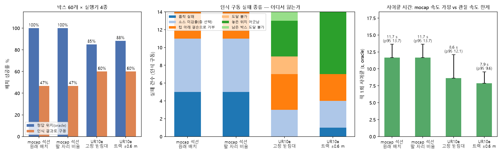

새로 채운 배관 (`robotsim_perception/pose.py`):

- `T_base_cam` 4×4 동차변환 + 로드/저장 — 그동안 모든 출력이 카메라 좌표 mm 라 로봇이 실행할 수 없었다
- `PickPose` — 로봇 베이스 좌표의 위치 + 접근 벡터 + **요(yaw)** + pre-pick/post-pick 경유점
- `suction_footprint_ok` — 컵 풋프린트 아래 유효 픽셀 비율·평탄도로 픽 가능 여부 판정 (박스 단위 지표로는
  중심부에 결손이 있는 박스를 못 거른다). 폐루프에서 5회 거부로 실제 작동 확인

**트윈 하네스를 만들며 드러난 설계 누락 3건** (전부 실제 셀에서 필요한 것):

1. **소스/목적지 영역 구분이 없었다** — 목적지 스택이 소스와 같은 높이가 되면 같은 층으로 검출되어
   플래너가 방금 옮긴 박스를 다시 집었다(같은 박스 4회 픽). 인식 ROI 를 소스 팔레트로 한정해 해결.
2. **목적지 배치 계획이 없었다** — 모든 박스를 목적지 중심 한 점에 떨어뜨려 서로 부딪혀 무너졌다.
   4×3 격자 슬롯·층 단위 적재로 교체.
3. **흡착 판정이 '가장 가까운 박스'였다** — 컵 아래가 아닌 옆 박스를 측면으로 어긋나게 물어 그만큼
   빗나가게 놓았다. 측면 90mm 이내 + 수직 45mm 이내로 분리.

**이 폐루프가 검증하지 않는 것**: 팔 기구학·IK·도달범위·특이점·주변 충돌(석션 EE 를 mocap 으로 직접 구동).
흡착 후 이송은 운동학적 부착으로 모델링해 석션 컴플라이언스·이송 중 흔들림·관성 파지 실패가 빠져 있다
(파지 전 접촉과 해제 후 안착은 물리 계산). 따라서 성공률의 절대값이 아니라
**oracle 대비 인식 비용(40%p)** 이 이 실험의 결과다.

## 실용성 검증과 한계 (정직한 평가)

기하 인식 파이프라인을 실제 배포 관점에서 점검한 결과. 실측 30프레임(실박스 167, RGB 대조 검증)에서
위치 일치 리콜(중심 80mm·각 25° 이내 1:1 매칭, `tools/robustness_bench_v2.py`):

| 항목 | v1 `detect_boxes` | v2 `detect_boxes_v2` |
|---|---|---|
| 지연시간 (CPU, 층 검출~치수 전 단계) | **52 ms/프레임** | 341 ms/프레임 |
| 클린 프레임 | 152/167 = 91.0% | **167/167**, 빈 프레임 오검출 0 |
| 추가 무효 픽셀 30% | 89% (치수 -3% 바이어스) | 99% |
| 깊이 노이즈 σ 20mm | 80% | 99% |
| 강도 대비 0.1× | 88% (에지 분리가 스케일 불변) | 100% |
| 대면적 결손 15 / 30개 (3시드 평균) | 73% / **57%** | 90% / **74%** — 여전히 가장 큰 약점 |

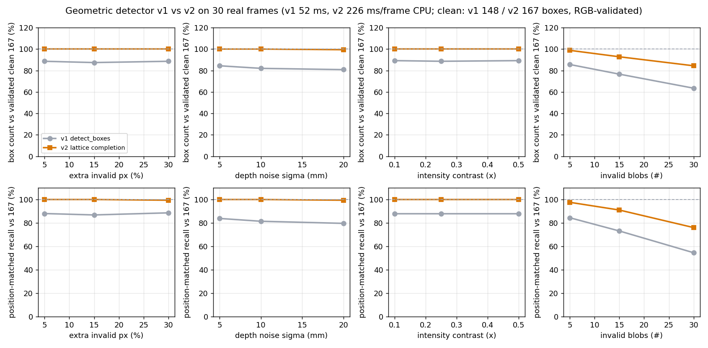

이전 표의 v1 수치(100%/91%/72%)는 v1 자체의 클린 출력을 기준으로 한 값이었고, 검증된 실박스 167개 기준으로 다시 계산했다.
v2 지연이 226 → 341 ms 로 늘어난 것은 층 선택을 히스토그램 질량이 아니라 후보 층을 실제로 검출해 비교하도록 바꾼 대가다(아래 8절).

**한계**: 단일 SKU·단일 카메라 포즈·30프레임에서만 검증됨. 실측 정답은 여전히 검출기 출력(pseudo-GT)이며 RGB 육안 대조로만 확인했다
(절대 오차는 위 8절의 셀 트윈에서만 측정된다) —
v1 정답은 실박스 19개(11%)를 배경으로 두었고, v2 정답으로 바꾸면 학습 모델 정밀도가 0.95 → 1.00 으로 오르는 만큼 정답 품질이 수치를 좌우한다.
sim2real의 0.98~0.99는 실측 6장이 동일 장비에서 나온 것이라 낙관적이며, 합성 전용 성능(0.48~0.57)이 보수적 수치다.
v2 검출기는 v1 대비 4배 느리고(226 ms) 격자 보완 셀이 무효 블롭 30개 조건에서 프레임당 ~0.2개 오검출을 낸다.

### 실제 로봇 셀까지 남은 것

이 레포는 **인식 → 계획**에서 끝난다. 셀에서 실제로 팔이 움직이려면 아래가 없다 (코드 대조로 확인):

| 없는 것 | 현재 상태 | 지금 가능? |
|---|---|---|
| 카메라→로봇 베이스 좌표 변환 (핸드아이 외참) | 모든 출력이 ToF 카메라 좌표 mm (`Box.center_mm`) | 배관·스키마는 가능, **실측값은 로봇 필요** |
| 6-DoF 픽 포즈 | 중심 + 법선(5-DoF)까지. 요(yaw)·접근/후퇴 높이 없음 | 가능 |
| IK·충돌 회피 궤적·석션 그리퍼 모델 | 없음 (`grep ik/collision/suction` = 0건) | 시뮬에서 가능 |
| 셀 디지털 트윈 (팔레트·박스·카메라 MJCF/USD) | 없음. MuJoCo 사용처는 기성 `gym_hil/PandaPickCube` 큐브 픽 | 가능 (지오메트리 수치는 이미 코드에 있음) |
| 런타임 인터페이스 (PLC/ROS2/TCP 핸드셰이크) | 없음. 진입점은 디스크 `.mim` 폴더를 읽는 CLI뿐 | 모의 클라이언트까지 가능 |
| 배포 패키지의 검출기 버전 | `robotsim_perception` 은 v1(148/167=88.6%), v2 미이식 | 가능 |
| 수동 정답(줄자 GT) | 정답이 검출기 자체 출력(pseudo-GT) + RGB 육안 대조 | **불가 — 측정 필요** |
| 혼합 SKU·손상 박스·다른 조명 | 단일 SKU·단일 포즈·연속 시퀀스 30프레임(레이아웃 2종) | **불가 — 데이터 필요** |

즉 **검출 알고리즘 자체는 이 데이터가 허용하는 상한(167/167)에 도달했지만, "로봇 셀에서 돌아가는 시스템"으로는 중간 단계**다.
남은 항목의 다수는 새 데이터·하드웨어 없이 시뮬레이션과 기존 30프레임으로 구축·검증할 수 있고, 절대 정확도 검증과
다른 SKU/조명 일반화만 실측을 기다린다.
팔레타이징 RL·모방학습·VLM 에이전트는 역량 실증용 프로토타입이며 배포 수준이 아니다.
배포 수준 주장에는 혼합 SKU·손상 박스·다른 조명 조건의 추가 데이터, 줄자/수동 라벨 정답, 실패 모드 분석이 필요하다.

## 빠른 시작

```powershell
E:\Robot_Sim\.venv\Scripts\Activate.ps1
pip install -r requirements.txt --extra-index-url https://download.pytorch.org/whl/cu126
python -c "import torch; print(torch.cuda.is_available(), torch.cuda.device_count())"
```

`requirements.txt` 는 이 머신에서 검증된 버전 조합이다 — **torch 2.9~2.11 과 mujoco 3.2.7+ 는
Windows 26200 에서 DLL 초기화 실패(WinError 1114)** 하므로 torch 2.8.0+cu126 / mujoco 3.1.6 으로 고정돼 있다.

셀 트윈·폐루프 재현:

```powershell
.venv\Scripts\python.exe tools/twin_detect_eval.py --scenes 24   # 절대 GT 검출 정확도
.venv\Scripts\python.exe tools/twin_closed_loop.py --episodes 10  # 인식->제어 폐루프
python -m pytest tests -q                                          # 패키지 테스트 27개
```

셋업이 안 돼 있으면 `docs/02_환경_셋업.md` ①부터.
