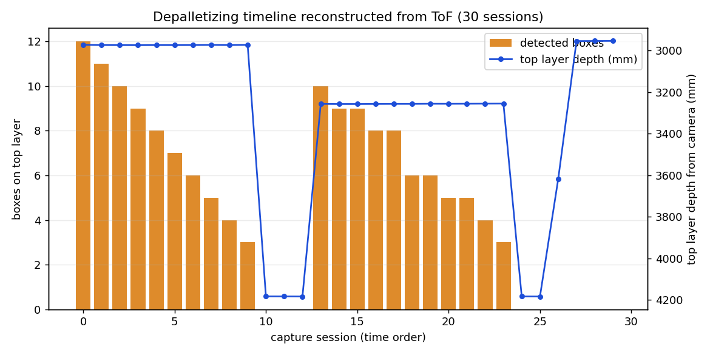
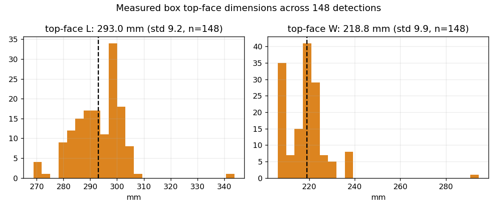
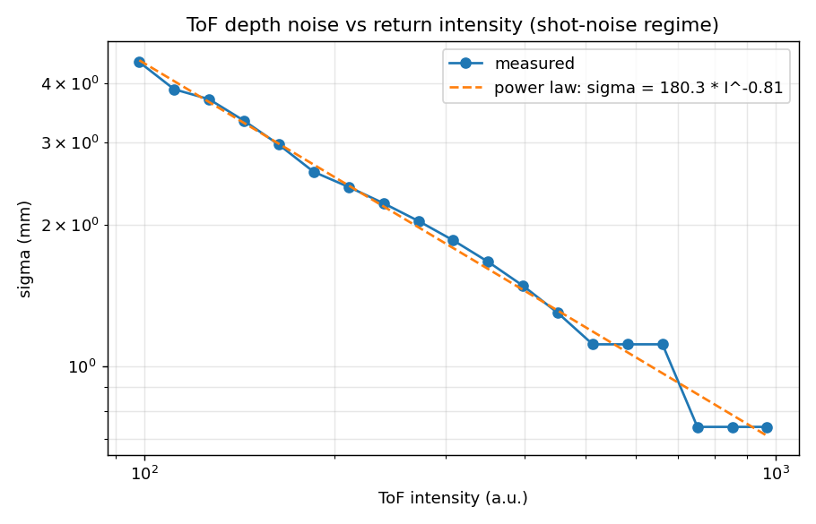
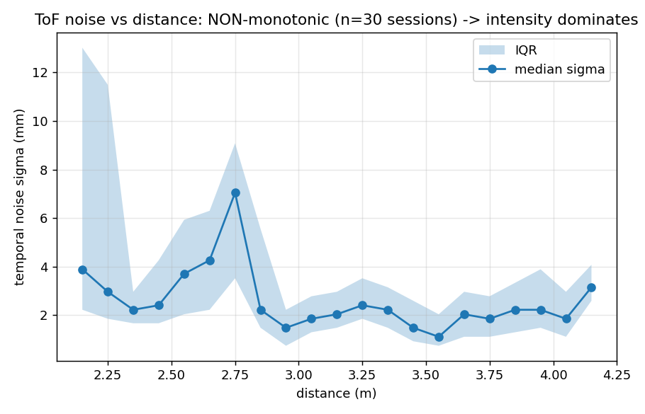
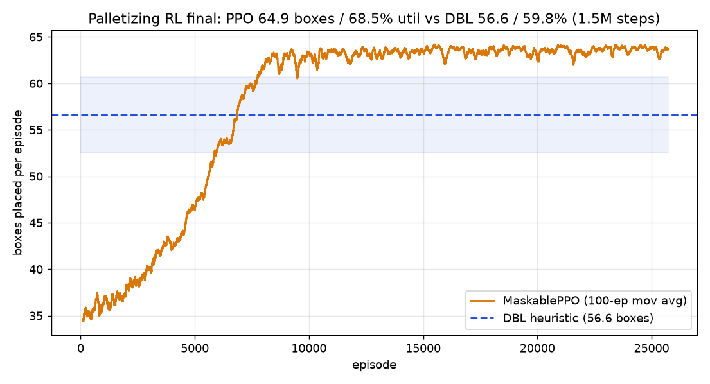
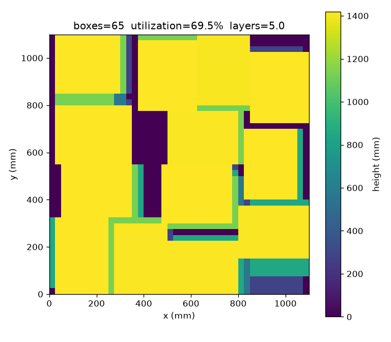
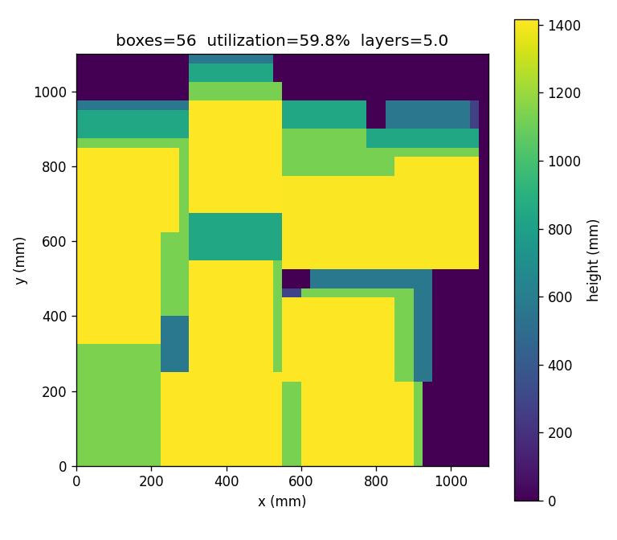

# Robot_Sim — 피지컬 AI 홈랩 (로컬 전용)

무료·데스크탑 전용으로 피지컬 AI(강화학습 / 모션 시뮬레이션 환경 구축 / sim2real / 3D 비전) 커리어 증거물을 만드는 작업 공간.
**모든 산출물은 로컬 우선. 외부 업로드는 `docs/03_공개전략_및_데이터보안.md` 기준으로만.**

## 환경

- RTX 3080 10GB ×2 (Ampere, NVLink 없음 — VRAM 풀링 불가)
- Windows 11 + WSL2 / Anaconda Python 3.12.4 (`D:\anaconda`)
- 데이터 자산: 실공장 대차 적재 RGB+ToF 이미지 (회사 데이터 — 외부 공개 금지)

## 문서

| 파일 | 내용 |
|---|---|
| [docs/01_무료_데스크탑_로드맵.md](docs/01_무료_데스크탑_로드맵.md) | **메인 로드맵** — 무료 트랙 T1~T8, 타임라인, 금지 목록 |
| [docs/00_하드웨어_판정.md](docs/00_하드웨어_판정.md) | 10GB에서 되는 것/안 되는 것 (공식 문서 검증값) |
| [docs/02_환경_셋업.md](docs/02_환경_셋업.md) | Windows/WSL2/Isaac Sim 4.5 설치 절차 |
| [docs/03_공개전략_및_데이터보안.md](docs/03_공개전략_및_데이터보안.md) | ⚠️ 공장 데이터 취급 원칙 + 공개 채널 전략 |
| [docs/research/](docs/research/) | 8개 도메인 리서치 원본 + 검증 리포트 (출처 링크 포함) |

## 트랙 요약 (전부 0원, 하드웨어 구매 불필요)

1. **T1** ToF 대차 인식 리포트 — 분할·치수측정(mm)·적재율 (보유 데이터)
2. **T2** LeRobot 시뮬 모방학습 부트캠프 — PushT/ALOHA/SmolVLA
3. **T3** gym-hil HIL-SERL — 실로봇 없는 강화학습 완주
4. **T4** 가상 SO-101 (LeIsaac) — 텔레옵→데이터셋→정책, 하드웨어 0원
5. **T5** 대차 디지털트윈 + 합성데이터 + sim2real 갭 ← **플래그십**
6. **T6** 팔레타이징 RL 환경 (실데이터 치수 분포로 시드)
7. **T7** ToF 노이즈 캘리브레이션 DR (회사 카메라 접근 시)
8. **T8** (옵션) Isaac Lab 10GB 실측 글 / MJWarp 벤치마크

## 결과 하이라이트 (실측 데이터 기반, 집계 수치만 공개)

> 산업 현장 고정 카메라의 RGB + ToF(X/Y/D/I, 640×480, mm) 데이터를 분석. 원본은 비공개(회사 데이터).

### 1. ToF만으로 디팔레타이징 로그 복원

깊이 히스토그램 층 검출 + **ToF 강도(I) 채널 에지로 박스 이음새 분리** → 30세션에서 박스 148개 검출.

- 상면 치수 **L = 293.0±9.2mm, W = 218.8±9.9mm** (변동계수 3%), 층간 깊이차로 박스 높이 283mm 도출
- 평면 피팅 픽포인트: 기울기 평균 0.95°(최대 2.7°), 평면 RMS 5.4mm
- 슬롯 추적으로 픽킹 순서 자동 복원 (1층 12→3개, 2층 10→3개, 세션당 1픽)




### 2. ToF 노이즈 모델: 거리가 아니라 강도가 지배한다

30세션에서 정적 픽셀 12.7만 개를 자동 선별해 시간적 노이즈 실측:

- σ vs 거리: **비단조** — 거리 기반 노이즈 모델(BlenderProc 기본 Kinect 모델 등)은 이 센서에 부적합
- σ vs 강도: 로그-로그 직선 → **σ(mm) = 180.3 × I^(-0.805)** (샷노이즈 물리와 정합)
- 활용: 합성 데이터(sim2real)의 depth 노이즈 주입을 실측 σ(I)로 캘리브레이션




### 3. 실측 치수로 시드한 팔레타이징 RL 환경

1100×1100mm(T-11) heightmap 환경, 지지율 제약 + action mask 내장 (`tools/palletize_env.py`):

- DBL 휴리스틱 베이스라인: **56.6±4.1박스, 활용률 59.8%** (max 120박스, 100 에피소드)
- **MaskablePPO (1.5M 스텝): 64.9박스, 활용률 68.5%±0.6%** — 동일 시드 100 에피소드 공정 평가에서 **휴리스틱 대비 +14.7% 박스, +8.7%p 활용률, 분산 대폭 감소**



같은 시드(68)에서의 최종 적재 비교 — PPO 65박스 vs DBL 56박스:

| MaskablePPO | DBL 휴리스틱 |
|---|---|
|  |  |

## 빠른 시작

```powershell
E:\Robot_Sim\.venv\Scripts\Activate.ps1
python -c "import torch; print(torch.cuda.is_available(), torch.cuda.device_count())"
```

셋업이 안 돼 있으면 `docs/02_환경_셋업.md` ①부터.
