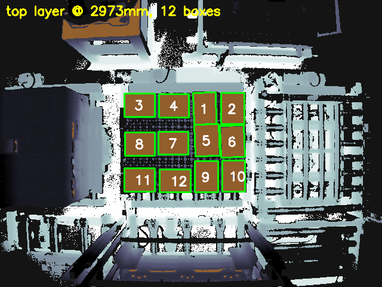
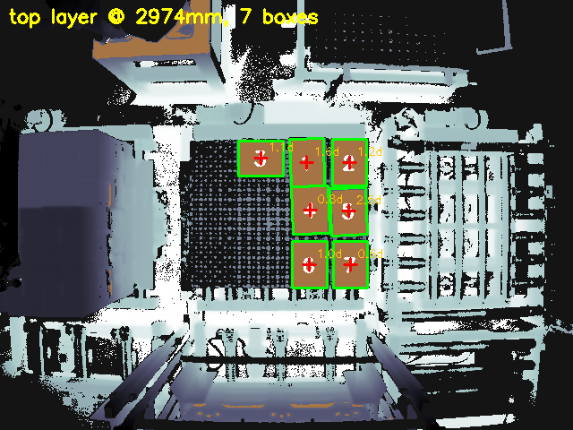
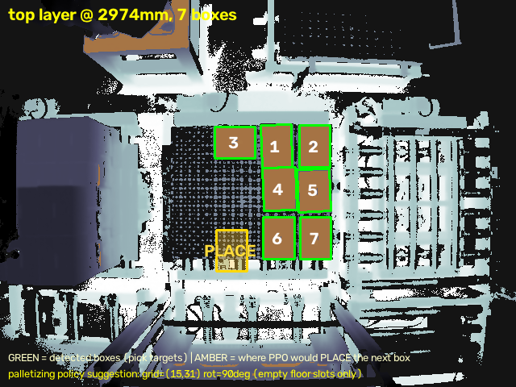
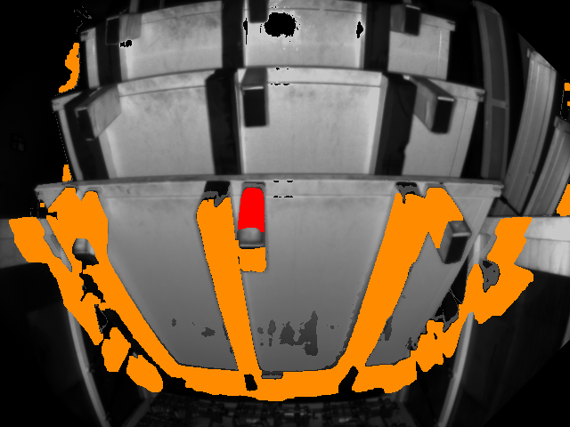

# Robot_Sim — 물류 로봇 인식·강화학습 파이프라인

산업 물류 현장의 RGB+ToF 실측 데이터를 기반으로 **3D 인식 → 센서 모델링 → 시뮬레이션·강화학습 → 인식-정책 통합**까지
엔드투엔드로 구축한 개인 연구 프로젝트. 모든 수치는 실측·재현 가능한 실험 결과이며,
데이터 보안 원칙(`docs/03`)에 따라 원본 데이터는 비공개, 집계 결과와 depth 시각화만 공개한다.

## 환경

- RTX 3080 10GB ×2 (Ampere, NVLink 없음 — VRAM 풀링 불가)
- Windows 11 + WSL2 / Anaconda Python 3.12.4 (`D:\anaconda`)
- 데이터 자산: 실공장 대차 적재 RGB+ToF 이미지 (회사 데이터 — 외부 공개 금지)

## 문서

| 파일 | 내용 |
|---|---|
| [docs/01_무료_데스크탑_로드맵.md](docs/01_무료_데스크탑_로드맵.md) | **메인 로드맵** — 무료 트랙 T1~T8, 타임라인, 금지 목록 |
| [docs/00_하드웨어_판정.md](docs/00_하드웨어_판정.md) | 10GB에서 되는 것/안 되는 것 (공식 문서 검증값) |
| [docs/02_환경_셋업.md](docs/02_환경_셋업.md) | Windows/WSL2/Isaac Sim 4.5 설치 절차 |
| [docs/03_공개전략_및_데이터보안.md](docs/03_공개전략_및_데이터보안.md) | ⚠️ 공장 데이터 취급 원칙 + 공개 채널 전략 |
| [docs/research/](docs/research/) | 8개 도메인 리서치 원본 + 검증 리포트 (출처 링크 포함) |

## 프로젝트 구성

| 영역 | 내용 | 상태 |
|---|---|---|
| **3D 인식** | ToF 단독 박스 검출·mm 치수측정·픽포인트·픽 순서 복원 | ✅ 완료 |
| **센서 모델링** | ToF 노이즈 실측 모델 σ(I) — 합성데이터 캘리브레이션 근거 | ✅ 완료 |
| **강화학습** | 실측 치수 기반 팔레타이징 환경 구축 + MaskablePPO (휴리스틱 +14.7%) | ✅ 완료 |
| **인식-정책 통합** | 실장면 상태 이식 → 최소동선 PICK / 목적지 PLACE 제안 (실제 순서로 검증) | ✅ 완료 |
| **합성데이터·sim2real** | 물리 시뮬 렌더링으로 학습데이터 생성 → 실측 데이터로 전이 성능 측정 | 🔄 진행 |
| **로봇 학습 인프라** | LeRobot 파이프라인, SmolVLA-450M 파인튜닝 자원 실측 (VRAM 4.7GB/10GB) | ✅ 완료 |

## 역량 매핑 (채용 요건 → 증거)

| 요구 역량 | 이 프로젝트의 증거 | 상세 |
|---|---|---|
| 물리엔진 시뮬레이션 기반 강화학습 환경 구축 | 실측 치수 시드 팔레타이징 환경 직접 설계 → PPO가 휴리스틱 +14.7% | [tools/palletize_env.py](tools/palletize_env.py) |
| 로봇 비전 무교시(teaching-less) | 라벨 0장으로 픽포인트(중심+법선) 자동 생성, 기울기 0.95° | [tools/binpick_pickpoints.py](tools/binpick_pickpoints.py) |
| AI 비전 ↔ 로봇 제어 연동 | 인식 상태 → RL 정책 → PICK/PLACE 제안, 실제 작업 순서로 검증(top-2 81%) | [tools/pick_next.py](tools/pick_next.py) |
| 합성 데이터 생성 · sim2real | 실측 노이즈 법칙 σ(I) 주입 합성 학습 → 실데이터 갭 측정 (진행) | [tools/sdg_boxdrop.py](tools/sdg_boxdrop.py) |
| 로봇 Foundation 모델 응용 | SmolVLA-450M 파인튜닝 자원 실측 (VRAM 4.7GB/10GB, 2h06m) | [docs/21_실험로그.md](docs/21_실험로그.md) |
| 경력기술·면접 정리 | STAR 서술 + 예상 Q&A | [docs/30_포트폴리오_경력기술.md](docs/30_포트폴리오_경력기술.md) |

## 아키텍처

전체 파이프라인 다이어그램(데이터→인식→RL→통합데모, Mermaid 렌더링): **[docs/ARCHITECTURE.md](docs/ARCHITECTURE.md)**
· 편집용 손그림 소스: [docs/diagrams/pipeline.excalidraw](docs/diagrams/pipeline.excalidraw)

## 결과 하이라이트 (실측 데이터 기반, 집계 수치만 공개)

> 산업 현장 고정 카메라의 RGB + ToF(X/Y/D/I, 640×480, mm) 데이터를 분석. 원본은 비공개(회사 데이터).

### 1. ToF만으로 디팔레타이징 로그 복원

깊이 히스토그램 층 검출 + **ToF 강도(I) 채널 에지로 박스 이음새 분리** → 30세션에서 박스 148개 검출.

- 상면 치수 **L = 293.0±9.2mm, W = 218.8±9.9mm** (변동계수 3%), 층간 깊이차로 박스 높이 283mm 도출
- 평면 피팅 픽포인트: 기울기 평균 0.95°(최대 2.7°), 평면 RMS 5.4mm
- 슬롯 추적으로 픽킹 순서 자동 복원 (1층 12→3개, 2층 10→3개, 세션당 1픽)


### 1.5 인식 → 정책 연동 데모

검출(초록) 상태를 학습된 팔레타이징 PPO에 이식 → 다음 배치 위치(앰버 NEXT)를 빈 슬롯에 제안:

| 상면 검출 + mm 치수 | 픽포인트(십자) + 기울기 | PPO 배치 제안 | 대차 후크 검출 |
|---|---|---|---|
|  |  |  |  |

*(depth 기반 시각화만 공개 — RGB 원본은 비공개 원칙 유지)*

### 2. ToF 노이즈 모델: 거리가 아니라 강도가 지배한다

30세션에서 정적 픽셀 12.7만 개를 자동 선별해 시간적 노이즈 실측:

- σ vs 거리: **비단조** — 거리 기반 노이즈 모델(BlenderProc 기본 Kinect 모델 등)은 이 센서에 부적합
- σ vs 강도: 로그-로그 직선 → **σ(mm) = 180.3 × I^(-0.805)** (샷노이즈 물리와 정합)
- 활용: 합성 데이터(sim2real)의 depth 노이즈 주입을 실측 σ(I)로 캘리브레이션


### 3. 실측 치수로 시드한 팔레타이징 RL 환경

1100×1100mm(T-11) heightmap 환경, 지지율 제약 + action mask 내장 (`tools/palletize_env.py`):

- DBL 휴리스틱 베이스라인: **56.6±4.1박스, 활용률 59.8%** (max 120박스, 100 에피소드)
- **MaskablePPO (1.5M 스텝): 64.9박스, 활용률 68.5%±0.6%** — 동일 시드 100 에피소드 공정 평가에서 **휴리스틱 대비 +14.7% 박스, +8.7%p 활용률, 분산 대폭 감소**


같은 시드(68)에서의 최종 적재 비교 — PPO 65박스 vs DBL 56박스:

| MaskablePPO | DBL 휴리스틱 |
|---|---|
|  |  |

## 빠른 시작

```powershell
E:\Robot_Sim\.venv\Scripts\Activate.ps1
python -c "import torch; print(torch.cuda.is_available(), torch.cuda.device_count())"
```

셋업이 안 돼 있으면 `docs/02_환경_셋업.md` ①부터.
