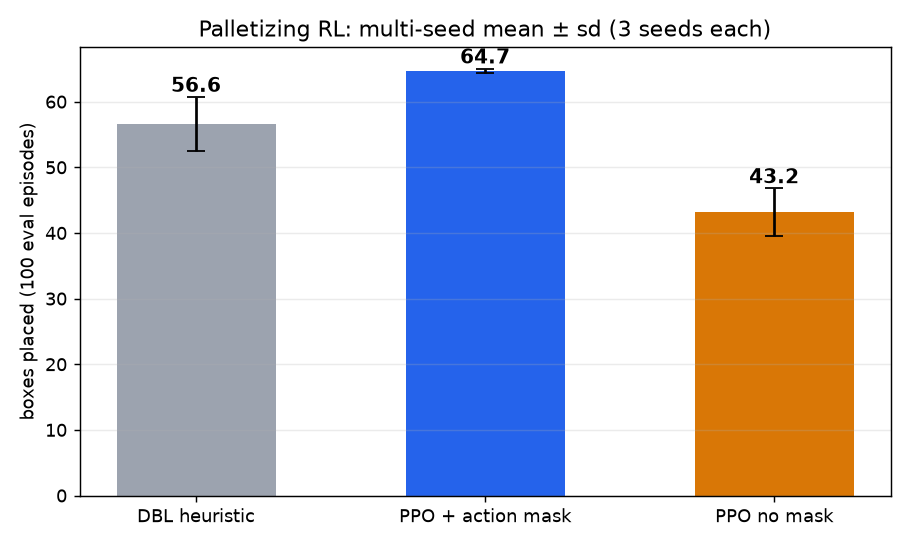

# 결과 상세 (실측 데이터 기반, 집계 수치만 공개)

> README 의 한 장 요약에서 옮겨 온 상세 결과. 각 절의 원본 수치는 [`results/`](../results/) JSON 에 있다.
> 그림은 depth 시각화·집계 차트만 공개한다 (RGB 원본 비공개, `03_공개전략_및_데이터보안.md`).

## 결과 하이라이트 (실측 데이터 기반, 집계 수치만 공개)

> 산업 현장 고정 카메라의 RGB + ToF(X/Y/D/I, 640×480, mm) 데이터를 분석. 원본은 비공개(회사 데이터).

### 1. ToF 기반 박스 검출·치수 측정

깊이 히스토그램 층 검출과 강도(I) 채널 에지 분리로 박스를 검출한다 (라벨·학습 없음). v1 은 30세션에서 152개를 검출하고,
30프레임을 RGB(비공개, 로컬 대조)로 전수 확인한 실제 박스 수는 **167개**다. v2 가 167/167 을 회수한다.

- 상면 치수 **L = 292.3±8.0mm, W = 217.7±7.6mm** (167박스), 층간 깊이차로 박스 높이 283mm 도출
- 평면 피팅 픽포인트: 기울기 평균 0.95°(최대 2.7°), 평면 RMS 5.4mm
- 슬롯 추적으로 픽킹 순서 자동 복원 (두 층 모두 12개 → 세션당 1픽, 우측 열이 마지막)
- **v1 누락 15개의 원인**: 2층 4×3 격자 중앙 2개가 강도 에지 절단 실패로 병합(7프레임), 층 말미 잔여 박스 1~2개가
  중앙 ROI 히스토그램 피크의 바닥/티어시트 전환으로 누락(4프레임 6박스). 병합된 3건은 과대 치수(350×294mm)로
  검출되어 SKU 신뢰도 0.62 로 표시된다 — 로봇이 두 박스 사이를 흡착하지 않도록 걸러내야 하는 케이스
- **v2** (`detect_boxes_v2`): 신뢰 박스들로 격자(방향·치수·피치)를 추정해 상면 지지도 ≥ 0.3·모순 픽셀 ≤ 8% 인 셀을 보완하고,
  층 선택은 '신뢰 박스가 있는 층 중 최근접' → **167/167, 빈 크레이트·빈 팔레트·티어시트 프레임 오검출 0, 약 340 ms/프레임**

*(위: 2층 중앙 2박스 병합 → 격자 보완 / 아래: 잔여 2박스가 바닥 피크에 밀림 → 층 재시도. depth 시각화만 공개)*

### 1.5 인식 → 정책 연동 데모

검출 결과를 정책 입력으로 연결해 다음 픽 대상을 제안. 실제 픽 순서 마이닝으로 열 스캔 규칙을 도출해 일치율 50%→81%:

| 상면 검출 + mm 치수 | 픽포인트(십자) + 기울기 | 최소 동선 픽 제안 | 대차 후크 검출 |
|---|---|---|---|
|  |  |  |  |

*(depth 기반 시각화만 공개 — RGB 원본은 비공개 원칙 유지)*

### 2. ToF 깊이 노이즈 특성 분석

30세션에서 정적 픽셀 12.7만 개를 자동 선별해 시간적 노이즈 실측:

- σ-거리 관계는 비단조, σ-강도 관계는 로그-로그 선형: **σ(mm) = 180.3 × I^(-0.805)**
- 거리 기반 표준 노이즈 모델 대신 강도 기반 모델이 이 센서에 적합함을 확인
- 활용: 합성 데이터(sim2real)의 depth 노이즈 주입을 실측 σ(I)로 캘리브레이션

### 3. 팔레타이징 강화학습

1100×1100mm(T-11) heightmap 환경, 지지율 제약 + action mask 내장 (`tools/palletize_env.py`):

**시드 3개 × (action mask 유/무)** 로 재실행 (각 500k 스텝, 동일 시드 100 에피소드 평가):

| 구성 | 박스 수 (평균 ± sd, n=3) | 활용률 |
|---|---|---|
| DBL 휴리스틱 | 56.6 ± 4.1 | 59.8% |
| **MaskablePPO (action mask)** | **64.7 ± 0.3** | **68.2 ± 0.3%** |
| PPO (mask 제거 ablation) | 43.2 ± 3.6 | 45.6 ± 3.8% |

- 휴리스틱 대비 **+14.3% 박스**, 런 간 분산은 1/13 (±4.1 → ±0.3)
- **action mask 를 빼면 43.2박스로 휴리스틱보다도 못하다 (−21.5박스).** 부가 최적화가 아니라
  이 환경에서 RL 이 성립하는 조건이다
- 같은 500k 스텝에서 에피소드 길이가 49 vs **3080 스텝** — 마스크가 없으면 정책이 무효 배치를
  반복하느라 스텝의 대부분을 낭비한다 (에피소드 수 30288 vs 487)
- 기존 단일 런(1.5M 스텝, 64.9박스)과 500k 3시드 평균(64.7)이 일치 — 곡선이 500k 에서 플래토라는
  기존 관찰과 맞고, 단일 런 수치가 대표성이 있었음을 사후 확인

같은 시드(68)에서의 최종 적재 비교 — PPO 65박스 vs DBL 56박스:

| MaskablePPO | DBL 휴리스틱 |
|---|---|
|  |  |

### 4. 합성데이터 sim2real

물리 시뮬(BlenderProc)로 실측 지오메트리를 재현(상면 깊이 오차 9mm)해 300씬 자동 라벨 생성.
합성 전용 학습 검출기를 실측 ToF 홀드아웃으로 평가:

| 학습 데이터 | 실측 mAP@50 |
|---|---|
| 합성 (clean) | 0.000 |
| 합성 + 실측 센서특성 시뮬(σ(I) 노이즈·무효픽셀) | 0.428 |
| 위 + 실측 6장 co-training | **0.988** |

정답 라벨 재검증: 위 표의 실측 정답은 v1 검출기 출력(148박스)이며 실제 박스 167개 중 19개(11%)가 배경으로 라벨돼 있었다.
v2 정답(홀드아웃 24장 115 → 128박스)으로 재평가하면 co-training 검출기 mAP50 0.988 → 0.983, **정밀도 0.949 → 0.998**, 리콜 1.000 → 0.945 —
기존 '오검출'은 v1 이 놓친 실박스였다. 합성 전용 모델은 0.43 → 0.48(BlenderProc), 0.56 → 0.57(Isaac) (`tools/reeval_v2_gt.py`).

SDG 툴 비교 — 같은 실측 조건·노이즈 레시피로 Isaac Sim 4.5 Replicator와 BlenderProc을 각각 300프레임 생성해 동일 홀드아웃 평가:

| 툴 | 실측 mAP@50 | 비고 |
|---|---|---|
| BlenderProc 2.8 | 0.428 | 물리 드롭, Cycles |
| Isaac Sim 4.5 Replicator | **0.555** | 정치 배치, RTX 레이트레이싱 |

### 5. 가상환경 제어·모방학습 (MuJoCo Franka)

- 순수 SAC(sparse/dense)는 파지 미완성(성공률 0) → 스크립티드 전문가(100%) 데모 수집
- 완벽 데모 BC = 0% (covariate shift) → **DART 노이즈 주입 복구 데이터로 BC 100%** (20 데모)
- PushT Diffusion 263M: 체크포인트 스윕 성공률 38%, 커버리지 85~90% (50 eps × 6 ckpt)

### 6. 학습 세그멘테이션 vs 기하 검출

- YOLO11n-seg: 합성(BlenderProc 276 + Isaac 276, 실측 ToF 노이즈 레시피) + 실측 6장 co-training, 60 epoch
- 실측 홀드아웃 24장: box/mask mAP50 **0.978**(v1 정답) → **0.991**(v2 정답, 정밀도 1.00) · GPU 21.9 ms / CPU 44 ms
- 열화 비교(기하 v1 대비 리콜): 깊이 노이즈 20mm 0.99 vs 0.90, 무효 블롭 30개 0.76 vs 0.66 — 학습 모델 우세
- **붕괴 모드**: 추가 무효 픽셀 15% 이상에서 리콜 0.00 (기하 0.99). 5×5 미디언 전처리로 15% 는 0.96 복구, 30% 는 0.40 —
  학습 분포 밖 무효 픽셀 밀도에 취약. 스펙클 증강이 다음 단계

### 7. 대차 후크 위치 반복성 (3D 정합)

- 4세션 후크 중심 RMS: raw 22.7mm → 전체 장면 ICP 17.6mm → **대차 데크(고정 구조물) ICP 2.9~3.2mm**, 면내 1.8mm
- 이전 '25mm 바이어스'는 대차 자체의 실이동(21~52mm)을 전체 장면 ICP 가 흡수하지 못한 정렬 오류 — 센서 반복성 문제가 아니었다
- 강도 분할 벽면 추정기(v2)는 v1 클러스터 중심과 동급(3D 3.16 vs 2.90mm, 면내 1.84 vs 2.46mm) — 지배 요인은 추정기가 아니라 정렬 기준

| 후크 추정기 마커 (ToF 강도 채널 위) | 정렬 방식별 후크 중심 산포 |
|---|---|
|  |  |

### 8. 셀 디지털 트윈 — 절대 정답 기반 검증 (MuJoCo)

실측 30프레임 평가의 근본 한계는 **정답이 검출기 자신의 출력**(pseudo-GT)이라 위치·치수 오차가 정의상 0이고
회귀를 잡을 수 없다는 점이었다. 실측 지오메트리를 그대로 옮긴 MuJoCo 셀 트윈에서는 박스의 실제 위치·자세를
`mjData` 에서 직접 읽으므로 **처음으로 절대 오차를 측정**할 수 있다.

트윈 구성 (`sim/cell_scene.py`): 카메라 바닥 위 4.183 m · f=517 px(fovy 49.8°) · 데크 0.643 m · 박스 293×219×283 mm ·
격자 피치 300×225 mm — 전부 실측 30프레임에서 역산한 값. 렌더 깊이의 상면이 2970 mm 로 실측 2973 mm 와 일치한다.
강도(I)는 실측에서 확인한 `I·D²≈3527` (능동조명 1/D² 감쇠)로, 노이즈는 실측 σ(I)=180.3·I^-0.805 + 결손 구조로 모델링.

48장면(잔여 1~12개 × 1~2층 × 클린/노이즈) 절대 정답 평가:

| 지표 | 클린 | ToF 노이즈 |
|---|---|---|
| 픽 중심 오차 (평균) | **8.5 mm** | **9.8 mm** |
| 픽 중심 오차 p95 | 28.7 mm | 33.7 mm |
| 치수 바이어스 L / W | −8.0 / −6.4 mm | −15.4 / −13.8 mm |
| 깊이 오차 | +0.0 mm | +0.0 mm |
| 리콜 / 정밀도 (잔여 ≥4개) | 0.87 / **0.95** | 0.80 / **0.97** |
| 리콜 / 정밀도 (잔여 ≤3개) | 0.20 / 0.07 | 0.50 / 0.14 |

**트윈이 찾아낸 결함 3건** (실측 30프레임으로는 드러나지 않던 것):

1. **센티넬 오염 버그** — `MORPH_CLOSE` 가 무효 픽셀 구멍을 메우면 그 픽셀의 X/Y 센티넬(8191.75)이
   `minAreaRect` 에 섞여 13 m 짜리 사각형이 나오고, 정상 박스가 종횡비 필터에서 탈락했다.
   실측에서도 **4개 박스가 이 경로로 누락**되고 있었다(v1 148 → 152). `tools/` 와 패키지 양쪽 수정.
2. **층 선택 결함** — 평평한 바닥이 중앙 ROI 를 지배하면 히스토그램 질량 1위가 바닥이 되고(트윈: 바닥 4184 mm
   strong 1개 vs 실제 박스층 3254 mm strong 5개), 기존 재시도 로직은 strong 이 0일 때만 작동해 재고하지 못했다.
   → **'strong ≥2 인 층 중 최근접'** 규칙으로 교체 (질량 최대도, strong 최다도 아님 — 다음에 집을 층은 가장 가까운 층이다).
3. **잔여 소수 실패 모드** — 가득 찬 아래층 위에 박스가 1~3개만 남으면 선택기가 아래층으로 점프한다.
   층 선택 임계를 'strong ≥2 중 최근접' → **'strong ≥1 중 최근접'** 으로 완화해 잔여 2개 케이스는 해결했고
   (실측 167 파리티 유지), 잔여 ≥4개 정밀도가 0.72 → **0.95** 로 올랐다. 잔여 1·3개는 **미해결**.

치수 바이어스(−8 ~ −15 mm ≈ −3 ~ −7%)는 `docs/40` 이 추정만 하던 경계 침식을 절대값으로 확인한 것이다.
깊이 오차가 0.0 mm 인 것은 층 깊이 추정이 정확함을 뜻한다.

**트윈 충실도 교정 (중요)**: 초기 트윈은 주변 설비 높이를 무작위(반높이 0.12~0.62 m)로 두어
설비 상단이 깊이 2.94 m 에 놓였다 — 박스 상면층(2.97 m)과 겹치는 위치다. 그래서 최상층 검출이
설비 표면과 경쟁했고, 이것이 트윈의 낮은 정밀도(0.62~0.64)의 주원인이었다. 실측 셀 설비는 그 높이에 없다.
높이를 데크 위 1층 상면 아래로 제한하자 정밀도가 **0.79** 로, 잔여 ≥4개 구간은 **0.95~0.97** 로 올랐다.

이 과정에서 **트윈 수치를 그대로 믿으면 안 된다는 사례**도 확인했다. 트윈은 고립된 상층 박스의 폭을
219 → 132 mm(−40%)로 측정했는데, 실측에서 같은 조건(가득 찬 1층 위 2층 박스 3개, 세션 380406)의
박스는 **293.7 × 216.2 mm 로 정상 측정**된다. 트윈이 어렵게 만든 조건이지 검출기 결함이 아니었다.
검출기를 이 신호에 맞춰 튜닝했다면 존재하지 않는 문제를 고치는 셈이었다.

**트윈의 한계**: 이 절의 폐루프는 석션 EE 를 mocap 으로 구동해 팔 기구학이 없다(§10 에서 UR10e 로 채웠다). 박스는 강체 균일 재질이라 눌림·라벨·필름이 없고,
조명은 단순 2광원이다. 따라서 트윈 수치는 실측을 대체하지 않으며, 알고리즘 결함 탐지와 상대 비교용이다.

### 9. 인식 → 제어 폐루프 (셀 트윈에서 실제로 집어 옮기기)

지금까지 "인식-정책 연동"은 depth 오버레이에 PICK/PLACE 를 **그리는** 데서 끝났고 실제로 무언가를 옮긴 적이 없었다.
셀 트윈에서 루프를 닫았다: 렌더(ToF) → `detect_boxes_v2` → 열 스캔 픽 순서 → **6-DoF 포즈(로봇 베이스 좌표)**
→ 석션 이동·흡착·이송·해제(물리) → 결과 판정 → 재촬영.

정책은 **인식 출력만** 본다(시뮬레이터의 정답 위치를 쓰지 않는다). 같은 컨트롤러를 정답 포즈로 구동한
oracle 을 나란히 돌려 인식 때문에 잃는 성능을 분리했다. 10 에피소드 × 6박스 = 60회:

| 구동 | 배치 성공률 | 실패 내역 |
|---|---|---|
| oracle (정답 포즈) | **100%** (60/60) | 없음 |
| perception (ToF 검출) | **43.3%** (26/60) | 소스 미검출 6, 흡착 실패 6, 전 후보 거부 4 |

**인식이 잃는 성능: 56.7%p.** 지배적 실패는 '소스 미검출'(층에 박스가 남았는데 검출 0 → 조기 종료)로,
8절의 잔여 소수 실패 모드가 그대로 폐루프 손실로 이어진다. 이 시나리오는 단층 6박스를 하나씩 비우므로
후반부가 전부 잔여 ≤3개 구간이라, 미해결 실패 모드의 영향을 가장 크게 받는 설정이다.

사이클 타임(물리 스텝 실측): oracle **11.9초/픽**(p95 13.7), 인식 구동 11.1초. 실측 셀 관측치 약 9초 대비
보수적인데 이송 속도를 0.6 m/s 로 잡았기 때문이다. 인식 지연(v2 340 ms)은 이 사이클의 3%, §10 의 팔 사이클(7.8 s)의 4% 로 병목이 아니다.

새로 채운 배관 (`robotsim_perception/pose.py`, `runtime.py`):

- `T_base_cam` 4×4 동차변환 + 로드/저장 — 그동안 모든 출력이 카메라 좌표 mm 라 로봇이 실행할 수 없었다
- `PickPose` — 로봇 베이스 좌표의 위치 + 접근 벡터 + **요(yaw)** + pre-pick/post-pick 경유점
- `suction_footprint_ok` — 컵 풋프린트 아래 유효 픽셀 비율·평탄도로 픽 가능 여부 판정 (박스 단위 지표로는
  중심부에 결손이 있는 박스를 못 거른다). 폐루프에서 실제 거부 발생
- **`runtime.decide()`** — 상위 제어기가 바로 분기할 상태: `OK / RETAKE / LOW_CONFIDENCE / LAYER_EMPTY / NO_SURFACE`.
  "박스 0개"가 층이 빈 건지 프레임이 나쁜 건지 구분하지 못하면 셀은 멈추거나 잘못 진행한다.
  실측 30프레임에서 박스 있는 25프레임 OK, 빈 5프레임 LAYER_EMPTY, 오탐 0. 임계는 JSON 설정으로 외부화
- **`runtime.HealthMonitor`** — 정적 배경 깊이 편차로 카메라 드리프트 감시(WARN 8mm / FAIL 25mm)

**트윈 하네스를 만들며 드러난 설계 누락 3건** (전부 실제 셀에서 필요한 것):

1. **소스/목적지 영역 구분이 없었다** — 목적지 스택이 소스와 같은 높이가 되면 같은 층으로 검출되어
   플래너가 방금 옮긴 박스를 다시 집었다(같은 박스 4회 픽). 인식 ROI 를 소스 팔레트로 한정해 해결.
2. **목적지 배치 계획이 없었다** — 모든 박스를 목적지 중심 한 점에 떨어뜨려 서로 부딪혀 무너졌다.
   격자 슬롯·층 단위 적재로 교체(§10: 소스 박스와 겹치는 4열째를 빼 3×3).
3. **흡착 판정이 '가장 가까운 박스'였다** — 컵 아래가 아닌 옆 박스를 측면으로 어긋나게 물어 그만큼
   빗나가게 놓았다. 측면 90mm 이내 + 수직 45mm 이내로 분리.
4. **풋프린트 거부 시 사이클을 통째로 버렸다** — 실제 셀이라면 다음 후보를 시도한다.
   픽 순서를 1개가 아니라 우선순위 목록으로 만들어 거부된 후보 다음을 시도하도록 수정.

**이 폐루프가 검증하지 않는 것**: 팔 기구학·IK·도달범위·특이점·주변 충돌(석션 EE 를 mocap 으로 직접 구동). 이 셋은 §10 의 UR10e 실행기가 본다.
흡착 후 이송은 운동학적 부착으로 모델링해 석션 컴플라이언스·이송 중 흔들림·관성 파지 실패가 빠져 있다
(파지 전 접촉과 해제 후 안착은 물리 계산). 따라서 성공률의 절대값이 아니라
**oracle 대비 인식 비용(56.7 %p)** 이 이 실험의 결과다. (팔 실행기의 인식 비용은 §10 — 35 %p. 단, 카메라에 팔이 보이면 층 선택이 달라져 두 실행기의
인식 구동 성공률을 직접 비교할 수는 없다.) 수치는 목적지 격자를 3×3 으로 바꾼 뒤 재측정한 것이다(이전 46.7%, 53.3 %p).

### 10. 팔 도달·충돌·사이클 — UR10e 를 트윈에 세우다

석션 EE 를 mocap 으로 순간이동시키던 트윈에 MuJoCo Menagerie 의 UR10e(6축, 도달 1.3 m)를 받침대 위에 얹고, 역기구학(감쇠
최소제곱, 관절 한계)·충돌 검사(MuJoCo 접촉)·관절 속도 한계(120/180°/s) 기반 사이클 시간을 붙였다. 자세한 방법과 표는
[docs/41 7절](41_셀_트윈.md#7-팔-도입--ur10e-도달-범위--충돌--사이클-시간).

| 질문 | 답 |
|---|---|
| 1.3 m 팔 하나로 소스·목적지 팔레트(중심 거리 1.19 m, 각 1.1 m 폭)를 다 다룰 수 있나 | 없다. 최적 고정 받침대(x −0.6, y 0.75, 높이 1.2 m)에서 트윈 목표 42개 중 90.5%. 반대편 모서리가 남는다 |
| 리니어 트랙(±0.6 m)을 더하면 | 100% (팔 베이스 높이는 고정 구성과 같게 맞춤). 이 셀에 1.2 m 급 팔을 쓰려면 트랙이 답이다 |
| 실측 픽 포즈 167개(30프레임 검출 결과)에 대해 | 트랙 구성: 도달 100%, 하강 무충돌 100%, 접근 무충돌 99.4%, 목적지 100%. 고정: 도달 87%, 접근 무충돌 98.6%, 목적지(픽 도달 중) 88% |
| 픽 1회 이동 시간 | 순수 이동 3.1 s + 흡착·해제 대기 0.6 s = 3.7 s (p95 4.6). mocap 실행기의 11.9 s 는 0.6 m/s 직교 속도 가정이었다 |
| 팔이 움직이는 폐루프(60박스, 같은 소스 장면) | oracle: mocap 100 / 고정 88.3 / 트랙 **100%**. 인식 구동: 43.3 / 53.3 / 65.0%. 인식 비용 56.7 / 35 / 35 %p. 시뮬 사이클 11.9 / 8.2 / 7.8 s |
| ROS2 그래프(인식 노드 → pick_executor → twin_bridge)가 트윈을 구동하면 | 12박스 중 명령 10회 · 배치 10 · 실패 0 · 남은 2개는 층 선택 미검출로 종료. 시뮬 사이클 7.5 s (§11) |

배운 것. (1) 처음 나온 "2층 하강 충돌 56%" 와 "1층 8건 도달 불가" 는 팔의 한계가 아니라 평가 도구의 결함이었다(IK 첫 해를 그대로 씀,
트랙 축 가중치). 검토에서는 경로 샘플 부족, 트랙 베이스 높이 불일치, 자기 충돌 무시, 정착 전 팔 자세, 실행기 간 설비 집합 불일치가
더 나와 고쳤다. (2) 놓는 순간 박스가 튕기던 것(이전 실행 oracle 2~7건)은 '운동학적 이송 아티팩트'가 아니라 제어 결함 셋이었다 — 픽 요 규약
(minAreaRect 각도가 짧은 변 기준이면 90도 어긋남), 팔뚝이 든 박스를 관통하는 IK 해, 소스 박스와 1.6 mm 겹치는 목적지 4열째 슬롯.
ROS 연결 실행에서 드러나 접촉 로그로 추적했고, 고친 뒤 트랙 실행기는 oracle 60/60 이다(docs/41 7절). (3) 인식 구동의 손실은 실행기 공통으로
'소스 미검출로 에피소드 조기 종료 → 남은 박스 포기'가 지배한다(mocap 24박스, 팔 11~13박스). 실행기 간 인식 성공률 차이는 카메라에 팔이
보여 층 히스토그램이 달라진 장면 차이라(같은 배치 15프레임 중 6프레임 검출 수 상이) 실행기 성능으로 읽을 수 없다.

여전히 없는 것: 장애물을 돌아가는 경로 계획(충돌하면 그 픽을 포기), 석션 물리(부드러운 해제는 대용), 관절 토크 한계. 수치 원본
`results/twin_arm_reach.json`, `results/twin_closed_loop_arm_{track,fixed}.json`, `results/twin_closed_loop_mocap_armlayout.json`.

### 11. ROS2 그래프 ↔ 트윈 연결 — 노드가 낸 명령을 시뮬레이터의 팔이 실행

`twin_bridge` 노드가 `/robot/target_poses`(pick_executor 의 3점)를 TCP 로 Windows 의 트윈 서버(`tools/twin_server.py`)에 보내면 트윈의 UR10e 가
IK·직선 하강·흡착·목적지 배치를 수행하고 결과를 `/robot/execution_result` 로 보고한다. 인식 노드는 같은 트윈을 카메라로 쓴다(`source:=twin://…`).
pick_executor 는 고정 타이머 대신 이 완료 보고를 기다리고, 실패로 보고된 후보는 막아 다음 후보를 낸다. 12박스 한 팔레트: 명령 10회, 배치 10,
실패 0, 프레임 13장, 남은 2개는 층 선택이 놓쳐(LAYER_EMPTY 3회) 종료. 시뮬 사이클 7.5 s(6.3~10.9), 한 실행의 계산 1.2 s, 명령 픽 위치와
실제 집은 박스 중심의 차이 중앙값 7 mm(최대 89 mm, 격자 보완 칸), 브리지가 TCP 경로를
실시간으로 재생해 rviz 에서 팔 끝이 움직인다. 첫 실행에서 12박스 중 6개가 튕겨 나간 것이 §10 (2)의 제어 결함 추적으로 이어졌다 — 노드를
실제 실행기에 물려 보는 것이 오프라인 평가가 못 잡는 결함을 드러낸 사례다. 기록: [docs/42 6-c](42_ROS2_핸즈온.md), `results/ros2_twin_cycle.json`.

## 실용성 검증과 한계 (정직한 평가)

기하 인식 파이프라인을 실제 배포 관점에서 점검한 결과. 실측 30프레임(실박스 167, RGB 대조 검증)에서
위치 일치 리콜(중심 80mm·각 25° 이내 1:1 매칭, `tools/robustness_bench_v2.py`):

| 항목 | v1 `detect_boxes` | v2 `detect_boxes_v2` |
|---|---|---|
| 지연시간 (CPU, 층 검출~치수 전 단계) | **52 ms/프레임** | 341 ms/프레임 |
| 클린 프레임 | 152/167 = 91.0% | **167/167**, 빈 프레임 오검출 0 |
| 추가 무효 픽셀 30% | 89% (치수 -3% 바이어스) | 99% |
| 깊이 노이즈 σ 20mm | 80% | 99% |
| 강도 대비 0.1× | 88% (에지 분리가 스케일 불변) | 100% |
| 대면적 결손 15 / 30개 (3시드 평균) | 73% / **57%** | 90% / **74%** — 여전히 가장 큰 약점 |

이전 표의 v1 수치(100%/91%/72%)는 v1 자체의 클린 출력을 기준으로 한 값이었고, 검증된 실박스 167개 기준으로 다시 계산했다.
v2 지연이 226 → 341 ms 로 늘어난 것은 층 선택을 히스토그램 질량이 아니라 후보 층을 실제로 검출해 비교하도록 바꾼 대가다(아래 8절).

**한계**: 단일 SKU·단일 카메라 포즈·30프레임에서만 검증됨. 실측 정답은 여전히 검출기 출력(pseudo-GT)이며 RGB 육안 대조로만 확인했다
(절대 오차는 위 8절의 셀 트윈에서만 측정된다) —
v1 정답은 실박스 19개(11%)를 배경으로 두었고, v2 정답으로 바꾸면 학습 모델 정밀도가 0.95 → 1.00 으로 오르는 만큼 정답 품질이 수치를 좌우한다.
sim2real의 0.98~0.99는 실측 6장이 동일 장비에서 나온 것이라 낙관적이며, 합성 전용 성능(0.48~0.57)이 보수적 수치다.
v2 검출기는 v1 대비 약 6배 느리고(52 → 약 340 ms) 격자 보완 셀이 무효 블롭 30개 조건에서 프레임당 ~0.2개 오검출을 낸다.
다만 셀 트윈에서 측정한 사이클은 11.9초/픽(mocap), 7.8초/픽(UR10e 트랙)이라 인식 지연은 사이클의 3~4% 로 병목이 아니다.

### 실제 로봇 셀까지 남은 것

첫 점검 시점(9월 초)에는 이 레포가 **인식 → 계획**에서 끝났다(코드 대조로 확인). 이후 진행으로 상태가 바뀐 항목을 함께 적는다:

| 항목 | 첫 점검 시 | 현재 |
|---|---|---|
| 카메라→로봇 베이스 좌표 변환 (핸드아이 외참) | 모든 출력이 ToF 카메라 좌표 mm | 배관·스키마 완료 — `pose.py` `T_base_cam`, ROS TF `base_link → tof_optical`. **실측값은 로봇 필요** |
| 6-DoF 픽 포즈 | 중심 + 법선(5-DoF) | 완료 — 요·접근/후퇴 포함 `PickPose`, 석션 풋프린트 판정 |
| IK·충돌 회피 궤적·석션 그리퍼 모델 | 없음 | IK·충돌 검사·관절 속도 사이클은 완료(§10, UR10e). 장애물을 돌아가는 경로 계획과 석션 물리는 **여전히 없음** |
| 셀 디지털 트윈 (팔레트·박스·카메라 MJCF) | 없음 (기성 큐브 픽 환경만) | 완료 — MuJoCo 셀 트윈, 절대 정답 평가, 폐루프 (§8–9) |
| 런타임 인터페이스 | 없음 (`.mim` 폴더 CLI 뿐) | ROS2 노드 2종(빈피킹 `perception_node` · 대차 `cart_node`) + Trigger 서비스 + 판정 계층([docs/42](42_ROS2_핸즈온.md)). PLC/TCP 핸드셰이크는 없음 |
| 배포 패키지의 검출기 버전 | v1 (148/167), v2 미이식 | 완료 — v2 이식(`geometry.py` 단일 소스, 167/167) |
| 수동 정답(줄자 GT) | pseudo-GT + RGB 육안 대조 | **불가 — 측정 필요** (절대 오차는 트윈에서만) |
| 혼합 SKU·손상 박스·다른 조명 | 30프레임(레이아웃 2종) | **불가 — 데이터 필요** |

즉 검출 알고리즘은 이 데이터가 허용하는 상한(167/167)에 도달했고 좌표 변환·트윈·ROS2 배관까지 닫혔지만,
장애물을 돌아가는 경로 계획·석션 물리는 시뮬레이션에서 더 할 수 있고, 핸드아이 실측·수동 정답·데이터 다양성은 하드웨어와 새 데이터가 있어야 닫힌다.
팔레타이징 RL·모방학습·VLM 에이전트는 역량 실증용 프로토타입이며 배포 수준이 아니다.
배포 수준 주장에는 혼합 SKU·손상 박스·다른 조명 조건의 추가 데이터, 줄자/수동 라벨 정답, 실패 모드 분석이 필요하다.

---

## 역량 매핑 (채용 요건 → 증거)

| 요구 역량 | 이 프로젝트의 증거 | 상세 |
|---|---|---|
| 강화학습 환경 구축 | 실측 치수 시드 팔레타이징 환경 직접 설계(높이맵 + 지지율 제약 + action mask, **물리엔진 아님**) → 3시드 평균 휴리스틱 +14.3%, ablation 으로 마스크 기여 분리 | [tools/palletize_env.py](../tools/palletize_env.py) |
| 물리엔진 시뮬레이션 | BlenderProc·Isaac Sim 물리 드롭으로 합성데이터 생성, MuJoCo Franka 모방학습 — **적재 안정성 물리 검증은 미구현** | [tools/sdg_boxdrop.py](../tools/sdg_boxdrop.py) |
| 로봇 비전 무교시(teaching-less) | 라벨 0장으로 픽포인트(중심+법선) 자동 생성, 기울기 0.95° | [tools/binpick_pickpoints.py](../tools/binpick_pickpoints.py) |
| 3D 포인트클라우드 정합 | 대차 데크 ICP 로 대차 실이동(21~52 mm) 제거 → 후크 위치 반복성 3.2 mm (전체 장면 ICP 17.6 mm 의 오류 원인 규명) | [tools/hook_analysis_v2.py](../tools/hook_analysis_v2.py) |
| AI 비전 ↔ 로봇 제어 연동 | 셀 트윈에서 **인식 출력만으로 집어 옮기는 폐루프** — mocap 실행기 43.3% (oracle 100%, 11.9초/픽), UR10e 트랙 실행기 65% (oracle 100%, 7.8초/픽); ROS2 그래프가 트윈의 팔을 구동해 12박스 중 10개 배치·실패 0 (§9~§11) | [tools/twin_closed_loop.py](../tools/twin_closed_loop.py) · [tools/twin_server.py](../tools/twin_server.py) |
| 로봇 좌표계·파지 자세 | `T_base_cam` 변환 + 6-DoF 픽 포즈(요 포함) + 석션 풋프린트 판정; 대차는 구조물(평면·림·레일)에서 좌표계를 매 프레임 추정 | [robotsim_perception/pose.py](../robotsim_perception/pose.py) · [cart.py](../robotsim_perception/cart.py) |
| 로봇 기구학·도달 분석·셀 설계 | UR10e 를 트윈에 세워 IK·충돌·관절 속도로 평가: 받침대 위치 sweep(고정 90.5% → 트랙 100%), 실측 167포즈 도달 100%·무충돌 99~100%, 순수 이동 3.1 s, 페이로드 포함 충돌 검사·TCP 직선 이동으로 놓기 실패 0 | [sim/arm.py](../sim/arm.py) · [tools/twin_arm_reach.py](../tools/twin_arm_reach.py) |
| ROS 아키텍처·노드·메시지 통신 | ROS2 Humble 노드 4개 — 빈피킹(`perception_node`: 정적 TF, PoseArray, MarkerArray) · 대차(`cart_node`: **동적 TF** + 도킹 목표 포즈) · 제어(`pick_executor`: 픽 포즈 → 3점 로봇 명령, Trigger 서비스 클라이언트로 재촬영, 로봇 완료 보고 대기·실패 후보 차단) · `twin_bridge`(MuJoCo 트윈을 로봇 드라이버·카메라 자리에 TCP 로 연결 — 트윈의 UR10e 가 ROS 명령을 실제로 실행, §11), QoS, launch, rviz2, colcon test 35 | [ros2_ws/](../ros2_ws/src/) · [docs/42](42_ROS2_핸즈온.md) |
| 픽 순서 최적화 | 인식 상태 → 열 스캔 규칙, 실제 작업 순서와 81% 일치 | [tools/pick_next.py](../tools/pick_next.py) |
| 합성 데이터 생성 · sim2real | 합성 전용 0.00 → 센서특성 시뮬 0.43 → +실측 6장 0.99 (실측 홀드아웃 mAP50) | [tools/sdg_boxdrop.py](../tools/sdg_boxdrop.py) |
| 로봇 Foundation 모델 응용 | SmolVLA-450M 파인튜닝 자원 실측 (VRAM 4.7GB/10GB, 2h06m) | [docs/21_실험로그.md](21_실험로그.md) |
| LLM/VLM 에이전트 | 로컬 VLM이 depth 장면을 이해하고 인식 도구 결과로 픽 액션을 결정 (그라운딩 100%, VRAM 7.3GB) | [tools/vlm_agent_demo.py](../tools/vlm_agent_demo.py) |
