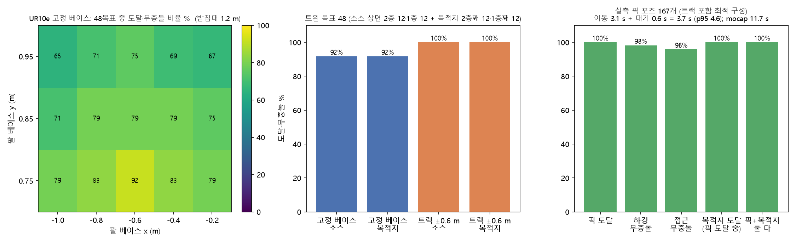

# 셀 디지털 트윈 (MuJoCo) — 구성·검증 범위·한계

> 코드: `sim/cell_scene.py`(MJCF 생성) · `sim/cell_twin.py`(렌더·정답) ·
> `tools/twin_detect_eval.py`(절대 정확도) · `tools/twin_closed_loop.py`(인식→제어 폐루프)

## 1. 왜 만들었나

실측 30프레임 평가의 근본 한계는 **정답이 검출기 자신의 출력**(pseudo-GT)이라는 점이었다.
RGB 육안 대조로 개수는 확인했지만 위치·치수 오차는 정의상 0이고, 파라미터를 바꿔도 회귀를 잡을 수 없다.
트윈에서는 박스의 실제 위치·자세를 `mjData` 에서 직접 읽으므로 절대 오차를 측정할 수 있다.

## 2. 지오메트리 — 전부 실측에서 역산

| 항목 | 값 | 근거 |
|---|---|---|
| 카메라 높이 | 바닥 위 4.183 m | 실측 빈 프레임 깊이 4183 mm |
| 초점거리 | 517 px @ 640×480 → fovy 49.79° | 상면 치수-깊이 역산 |
| 팔레트 데크 | 바닥 위 0.643 m | 1층 상면 3257 mm + 박스높이 283 mm |
| 박스 | 293 × 219 × 283 mm | 실측 167박스 평균 |
| 격자 피치 | 300 × 225 mm | `isaac_sdg_boxdrop.py` 와 동일 |
| 목적지 | 카메라 좌표 (−1191.4, −38.3) mm | `planner.py DEFAULT_DEST_XY_MM` |

**정합 확인**: 트윈 렌더 상면 깊이 2970 mm vs 실측 2973 mm.

강도(I) 채널은 실측에서 확인한 `I · D²  ≈ 3527` (능동조명 1/D² 감쇠)로 모델링하고,
노이즈는 실측 σ(I) = 180.3 · I^−0.805 + 에지 드롭아웃·스펙클·대면적 블롭으로 구성했다.

좌표 대응: `ToF_X = world_X`, `ToF_Y = −world_Y`, `ToF_D = CAM_H − world_Z`.

## 3. 트윈이 찾아낸 결함

실측 30프레임으로는 드러나지 않던 것들이며, 모두 수정 후 실측 파리티(167/167)를 재확인했다.

1. **센티넬 오염** — `MORPH_CLOSE` 가 메운 무효 픽셀의 X/Y 센티넬(8191.75)이 `minAreaRect` 에 섞여
   13 m 사각형이 나오고 정상 박스가 종횡비 필터에서 탈락. **실측에서도 4박스가 누락되고 있었다**(v1 148 → 152).
2. **층 선택** — 평평한 바닥이 중앙 ROI 를 지배하면 히스토그램 질량 1위가 바닥이 된다
   (트윈: 바닥 4184 mm strong 1개 vs 실제 박스층 3254 mm strong 5개). 기존 재시도는 strong=0 일 때만
   작동해 재고하지 못했다 → **'strong ≥2 인 층 중 최근접'** 규칙으로 교체.
3. **폐루프 하네스 설계 누락 4건** — 소스/목적지 ROI 구분 없음(방금 옮긴 박스 재픽),
   목적지 배치 계획 없음(한 점 낙하로 붕괴), 흡착 판정이 '최근접 박스'(옆 박스를 어긋나게 물음),
   풋프린트 거부 시 사이클 통째로 버림(다음 후보 시도로 수정).

## 3-b. 트윈 자신의 충실도 결함 (중요)

트윈이 낸 수치를 그대로 믿으면 안 된다는 사례를 두 건 확인했다.

1. **설비 높이** — 주변 설비 반높이를 0.12~0.62 m 로 무작위화해 상단이 깊이 2.94 m 에 놓였다.
   박스 상면층(2.97 m)과 겹쳐 최상층 검출이 설비 표면과 경쟁했고, 이것이 트윈 정밀도 0.62 의 주원인이었다.
   실측 셀엔 그 높이 설비가 없다. 0.10~0.44 로 제한하자 정밀도 0.79, 잔여 ≥4개 구간 0.95~0.97.
2. **고립 박스 침식** — 트윈은 고립된 상층 박스의 W 를 219 → 132 mm(−40%)로 측정한다.
   그러나 **실측에서 같은 조건**(가득 찬 1층 위 2층 박스 3개, 세션 380406)의 박스는
   **293.7 × 216.2 mm 로 정상 측정**된다(잔여 1~3개 n=12 평균). 트윈이 어렵게 만든 조건이지
   검출기 결함이 아니다. 검출기를 이 신호에 맞춰 튜닝했다면 존재하지 않는 문제를 고쳤을 것이다.

**교훈**: 트윈에서 나온 실패는 반드시 실측에 같은 조건이 있는지 먼저 확인한다.

## 4. 검증하는 것 / 하지 않는 것

**검증한다**
- 검출 절대 정확도: 중심 오차, 치수 바이어스, 각도·깊이 오차 (부트스트랩 95% CI 포함)
- 잔여 개수·층 수·노이즈 조건별 리콜/정밀도 분해
- 인식 출력만으로 집어 옮기는 폐루프 성공률, 그리고 정답 포즈 oracle 대비 **인식 비용**

**검증하지 않는다 (중요)**
- **팔 기구학·도달범위·충돌**은 7절의 UR10e 도입으로 이제 평가한다(IK·충돌 검사·관절 속도). 다만 경로 계획은
  '관절 공간 직선 보간 + 충돌 검사' 수준이고(RRT 같은 회피 계획 없음), 충돌은 경로를 10점으로 샘플링해 본다.
  `--arm none` 의 mocap 실행기는 여전히 도달·충돌을 보지 않는다.
- **석션 물리** — 흡착 후 이송은 운동학적 부착으로 모델링한다(MuJoCo weld 를 런타임에 켜면
  기본 relpose 가 항등이라 박스가 0.8 m 튕겨 나간다). 컵 컴플라이언스·이송 중 흔들림·관성 파지 실패 없음.
  파지 전 접촉과 해제 후 안착은 물리로 계산된다.
- **재질·조명 다양성** — 박스는 강체 균일 재질(눌림·라벨·스트레치 필름 없음), 광원 2개 고정.
- **혼합 SKU·손상 박스** — 단일 SKU 만.

따라서 폐루프 성공률의 **절대값**은 실제 셀 성능이 아니다. 이 실험의 결과는
**oracle 대비 인식 비용**(mocap 53 %p, UR10e 트랙 23 %p — 7절)과 **어떤 실패 모드가 지배적인가**이다.

## 5. 미해결

- **잔여 ≤3개 실패 모드**: 가득 찬 아래층 위에 박스가 1~3개만 남으면 층 선택기가 아래층으로 점프해
  정밀도가 0.15~0.18 로 무너진다(잔여 ≥4개에서는 0.72~0.75). 폐루프 손실의 지배 원인.
  두 번 시도했고 둘 다 기각했다.

  - **시도 1** (박스 높이 283 mm 위 층에서 SKU 치수에 맞는 박스를 찾으면 올라감): 실측이 167 → 155 로
    퇴행했다(세션 하나가 12 → 3). 설비 상단에서 우연히 SKU 크기인 조각을 잡고 올라간다.
  - **시도 2** (위 조건 + '적층 정합' = 위층 박스 중심이 아래층 박스 중심과 XY 일치): **원리적으로 성립 불가.**
    위층 박스는 바로 아래 박스를 가리므로 그 자리에 아래층 검출이 존재할 수 없다. 정합 카운트가 항상 0.

  다음 후보: 아래층 검출로 격자(피치·방향)를 추정해 상층 후보가 격자 **노드**에 오는지 검사한다
  (가려진 박스가 아니라 격자에 맞춘다). 단 트윈에서 고립된 상층 박스는 에지 침식이 커서 W 가
  219 → 132 mm 로 측정되므로 치수 게이트를 쓸 수 없다. 이 침식 폭(−40%)이 실측 평균(−15 mm)보다
  훨씬 크므로, **트윈 강도 모델이 이 케이스를 과장하고 있는지부터 확인**해야 한다.
- ~~팔 모델(도달거리 1.2 m 급) 도입 시 IK·충돌회피 평가 추가.~~ → 7절에서 UR10e 로 했다.

## 6. 재현

```powershell
.venv\Scripts\python.exe sim/cell_scene.py                        # MJCF 생성
.venv\Scripts\python.exe tools/twin_detect_eval.py --scenes 24     # 절대 정확도 (48장면)
.venv\Scripts\python.exe tools/twin_closed_loop.py --episodes 10   # 폐루프 (mocap 석션)
.venv\Scripts\python.exe tools/twin_arm_reach.py                   # UR10e 받침대 sweep · 트랙 · 실측 167포즈 도달/충돌/사이클 (약 5분)
.venv\Scripts\python.exe tools/twin_closed_loop.py --episodes 10 --arm track   # 팔이 움직이는 폐루프 (--arm fixed 도)
.venv\Scripts\python.exe tools/twin_closed_loop.py --episodes 10 --arm-layout  # mocap 을 팔 씬과 같은 배치에서 (비교용)
.venv\Scripts\python.exe tools/twin_closed_loop_chart.py           # 실행기 4종 비교 차트
python scripts/fetch_ur10e_meshes.py                              # (선택) UR10e 메시 34 MB — 그림용, 없어도 돈다
```

결과: `explore/twin/*.json` (비공개 원본) → `results/twin_*.json` (익명화 공개본).

## 7. 팔 도입 — UR10e 도달 범위 · 충돌 · 사이클 시간

지금까지 석션 EE 는 mocap 으로 순간이동했다. 그래서 "이 픽 포즈에 팔이 닿는가, 내려가다 옆 박스를 치는가, 한 사이클에
몇 초 걸리는가"를 답하지 못했다. MuJoCo Menagerie 의 UR10e(6축, 도달 1.3 m, BSD-3)를 받침대 위에 얹어 그 셋을 잰다.
코드: `sim/arm.py`(MJCF 조립·IK·충돌·시간), `tools/twin_arm_reach.py`(평가), `tools/twin_closed_loop.py --arm`(폐루프).

**방법**
- 좌표계: 트윈 월드 = 탑다운 카메라의 base_link. 팔 베이스는 받침대(원기둥) 위, 선택으로 x 방향 리니어 트랙(±0.6 m).
  트랙 구성은 레일과 캐리지 두께(0.12 m)만큼 받침대를 낮춰 팔 베이스 높이를 고정 구성과 같게 맞췄다(1.2 m).
- IK: 감쇠 최소제곱. 목표 = 흡착 컵 면(TCP) 위치 + 자세(툴 z 축 = 아래, x 축 = 박스 장축 요). 관절 한계 안에서 수렴(1 mm, 0.5°).
  6축은 같은 목표에 여러 자세가 있어서(팔꿈치 위/아래), 첫 해가 이웃 박스를 치면 다른 시드로 무충돌 해를 찾는다.
- 충돌: MuJoCo 접촉으로 팔 지오메트리가 박스·데크·설비·컨베이어에 닿는지, 그리고 비인접 링크끼리 겹치는지(자기 충돌) 본다.
  컵과 '집으려는 박스'(목표 바로 아래 박스 하나)의 접촉만 허용. 하강(pre-pick → pick, 6점)과 접근(직전 자세 → pre-pick,
  관절 보간; 샘플 수는 관절 이동량 0.05 rad 당 1점 이상) 경로를 각각 검사.
- 시간: UR10e 사양 관절 속도(베이스·숄더 120°/s, 나머지 180°/s)의 사다리꼴 프로파일. 흡착·해제 대기 0.3 s 씩은 따로 센다.
- 중력 보상: 위치 서보(kp 5000)만으로는 12.9 kg 상완이 1 m 밖에서 1~2 cm 처져서 바디마다 gravcomp 를 켰다(실제 제어기가 하는 일).
  이후 TCP 정지 오차 0.9 mm. 정착(settle) 전에 팔을 홈 자세로 두어야 한다 — 기본 qpos 0 은 팔이 수평으로 뻗은 자세라
  낮은 받침대에서는 정착 중 목적지 스택을 휩쓴다.

**A. 받침대 위치 sweep (트윈 목표 48개: 소스 상면 24 = 2층 12 + 1층 12, 목적지 24 = 2층째 12 + 1층째 12)**

| 받침대 | 도달·무충돌 | 소스 | 목적지 | 실패 |
|---|---|---|---|---|
| 고정, 최적 (x −0.6, y 0.75, 높이 1.2 m) | 92% (44/48) | 92% | 92% | IK 불가 4 (반대편 모서리) |
| 고정, 높이 0.6 m (15 구성 평균) | 49% | | | 낮을수록 팔꿈치가 박스 위로 못 넘어감 (최대 63%) |
| 리니어 트랙 ±0.6 m (베이스 높이 1.2 m 동일) | **100%** | 100% | 100% | 없음 |

소스와 목적지 팔레트 중심이 1.19 m 떨어져 있고 각 팔레트가 1.1 m 폭이라, 1.3 m 팔 하나로는 어디에 세워도 반대편 모서리에
닿지 않는다. 트랙을 더하면 전부 닿는다. 이것이 이 셀에 1.2 m 급 팔을 쓸 때의 설계 답이다.

**B. 실측 픽 포즈 167개** (30프레임 검출 결과를 로봇 좌표로 옮기고, 이웃 박스를 검출 위치에 세운 뒤 평가)

| 구성 | 픽 도달 | 하강 무충돌 | 접근 무충돌 | 목적지 도달 (픽 도달 중) | 이동 시간 (평균 / p95) |
|---|---|---|---|---|---|
| 고정 받침대 | 87.4% | 100% | 94.5% | 91.1% | 3.2 s / 3.9 s (+ 대기 0.6 s) |
| 트랙 ±0.6 m | **100%** | 98.2% | 95.8% | **100%** | 3.1 s / 4.0 s (+ 대기 0.6 s) |

층별(트랙): 1층 89포즈는 하강 무충돌 96.6%, 2층 78포즈는 접근 무충돌 91.0% 로 2층 접근에서 팔꿈치가 이웃 박스 위를 스치는
경로가 남는다(7건). 관절 보간 대신 경로 계획을 넣으면 없어질 종류다. 이동 시간 3.1 s 는 관절 속도 한계에서 나온 순수 이동이고,
흡착·해제 대기 0.6 s 를 더하면 3.7 s 다. mocap 실행기의 11.7 s 는 0.6 m/s 의 직교 속도 가정이었다.

**처음 결과가 틀렸던 것 (평가 도구의 결함)**: 첫 실행에서 2층 포즈의 하강 충돌이 56% 로 나왔다. 원인은 검출기도 팔도 아니고
IK 가 처음 수렴한 팔꿈치 아래 자세를 그대로 쓴 것이었다 → 여러 시드로 무충돌 자세를 찾게 하자 98%. '1층 8건 도달 불가' 는
트랙 축 가중치를 낮게 둔 탓에 풀이기가 트랙을 안 움직인 것이었다 → 가중치를 올려 재시도하면 1 mm 이내. 그다음 검토에서
경로 샘플 10점이 긴 이동에서 이웃 박스 스침을 놓치는 것(접근 무충돌 98 → 96%), 트랙 구성의 베이스가 0.12 m 높았던 것,
자기 충돌을 무시하던 것, 정착 전 팔이 수평으로 뻗어 있던 것이 나와 모두 고쳤다. "팔이 못 한다"고 적기 전에 풀이기와 평가 도구를
의심해야 한다는 교훈이다.



*왼콽: 팔 베이스 위치별 도달·무충돌 비율(받침대 1.2 m). 가운데: 최적 고정 베이스 vs 트랙. 오른쪽: 실측 167포즈 결과와 이동 시간.*

**C. 팔이 실제로 움직이는 폐루프** (`--arm fixed|track`, 박스 60개 = 10 에피소드 × 6, 세 실행기 모두 같은 장면)

팔 실행기는 pre-pick → 하강 → 흡착 → 상승 → 목적지 위 → 하강 → 해제 → 후퇴를 IK 와 관절 보간(최고 속도가 사양 한계를 넘지 않게)
으로 수행한다. 목표에 IK 가 안 풀리면 '도달 불가', 보간 경로에서 팔이 환경에 닿으면 '경로 충돌'로 그 박스를 건너뛰고 다음 후보로 간다.
목적지 슬롯은 팔이 닿는 것을 받침대에서 가까운 순으로 고른다(한 슬롯만 고집하면 고정 받침대에서는 전부 실패한다 — 1차 실행에서 0/60).
설비 배치는 세 실행기 모두 **정확히 같은 설비 집합**을 쓴다(공통 제외 구역; 검토에서 트랙 변형만 설비가 2~4개 적었던 것을 고침).

| 실행기 | oracle | 인식 구동 | 인식 비용 | oracle 실패 | 인식 구동 실패 | 시뮬 사이클 (oracle) |
|---|---|---|---|---|---|---|
| mocap 석션 (팔 없음) | 100% | 46.7% | 53.3 %p | 없음 | 소스 미검출로 조기 종료 6 에피소드(24박스 포기), 유령 검출 흡착 실패 5, 컵 아래 결손 3 | 11.7 s |
| UR10e 고정 받침대 | 85.0% | 60.0% | 25.0 %p | 남은 박스 도달 불가 6, 놓다가 튕김 2, 그 여파 미검출 1 | 조기 종료 3 에피소드(14박스), 튕김 4, 컵 아래 결손 4, 도달 불가 3 | 8.6 s |
| UR10e + 트랙 ±0.6 m | 88.3% | 60.0% | 28.3 %p | 놓다가 튕김 4, 그 여파 미검출 1 | 조기 종료 3 에피소드(13박스), 튕김 7, 컵 아래 결손 3, 흡착 실패 1 | 7.9 s |

읽는 법.
- oracle 열이 팔 자체의 한계다. 고정 받침대는 정답 위치를 줘도 15 %p 를 잃는데 6개는 '남은 박스에 못 닿음'이고 2개는 놓다가
  튕긴 것이다. 트랙을 달면 못 닿는 박스는 없어지지만 튕김 4건이 남아 88%.
- '튕김(misplaced)'은 놓은 위치가 0.3~35 m 어긋난 것으로, 내려놓는 순간 박스가 이웃과 겹쳐 접촉 임펄스로 튀어 나가는 운동학적
  이송 모델의 아티팩트다(mocap 은 수직으로만 내려놓아 0건). 요 각도 오차 같은 작은 어긋남이 아니다. 튕긴 박스가 카메라 가까이
  떠 있으면 다음 프레임의 '최상층'이 그 박스가 되어 소스가 비어 보이는 여파도 있다(oracle 미검출 1).
- 인식 구동에서 가장 큰 손실은 세 실행기 공통으로 **소스 미검출로 에피소드가 조기 종료되어 남은 박스를 포기하는 것**이다
  (mocap 24박스, 팔 13~14박스). 이 차이(6 vs 3 에피소드)가 mocap 46.7% 와 팔 60% 의 차이 대부분을 만든다. 10 에피소드에서
  3건 차이는 우연 범위라 실행기 덕분이라고 말할 근거는 없다. mocap 의 흡착 실패 5건은 전부 '컵 아래 90 mm 안에 박스 없음'
  (있지도 않은 박스를 검출한 유령 검출)이고, 팔 실행기에서는 그런 목표가 도달 불가·경로 충돌로 걸러지거나 튕김으로 바뀐다.
- 시뮬 사이클 7.9~8.6 s 는 물리 시뮬레이션 안의 값이다(관절 보간 + 이동 뒤 안정화 0.2 s × 6 + 흡착 0.12 s + 해제 1.2 s ≈ 대기 2.5 s,
  하강 두 구간은 0.4배 속도, 접근 여유 0.2~0.55 m). B 의 3.1 s 는 여유 0.15 m·전속력·대기 제외의 '순수 이동'이라 둘은 다른 값을 잰다.


**여전히 검증하지 않는 것**: 장애물을 돌아가는 경로 계획(충돌하면 그 픽을 포기), 석션 물리(튕김의 원인), 관절 토크 한계·실제 가감속
프로파일(속도 한계만), 받침대·트랙 강성.
