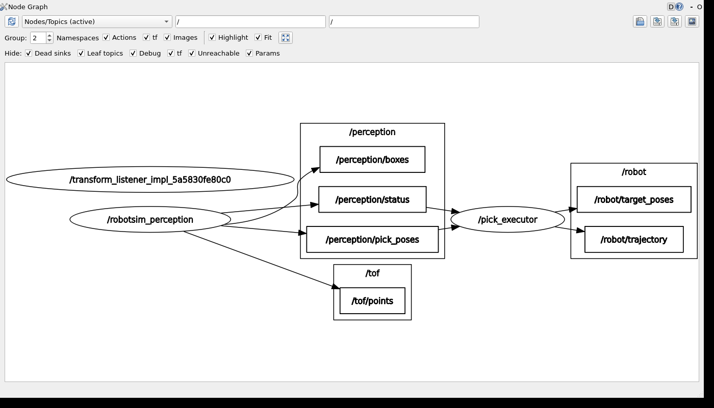
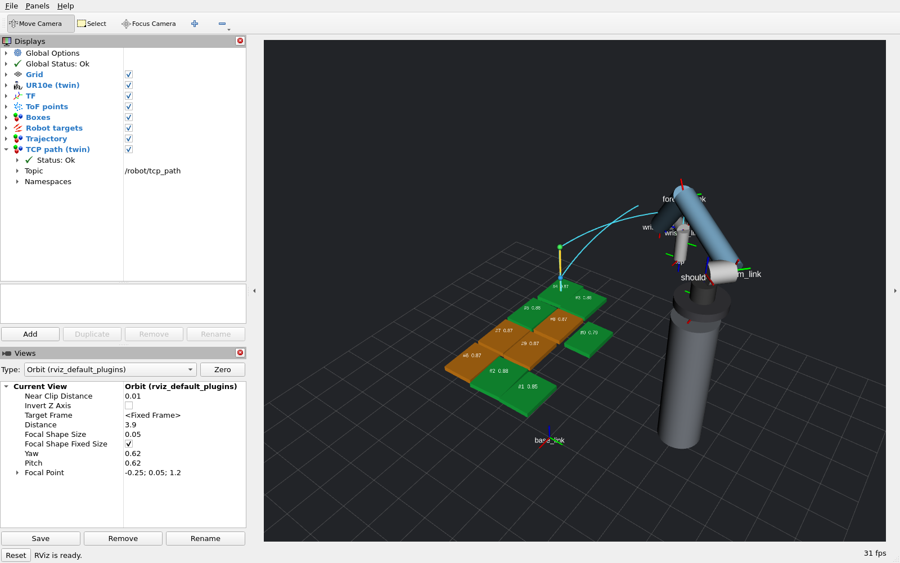
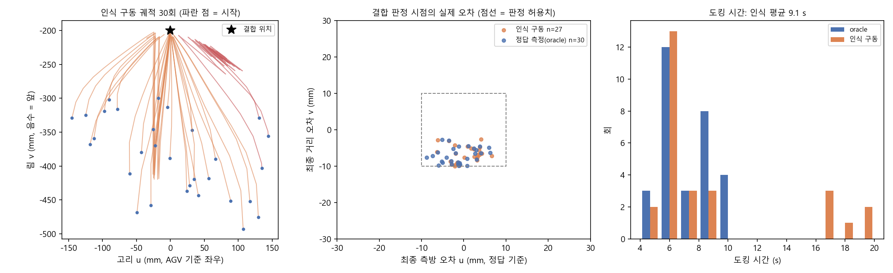
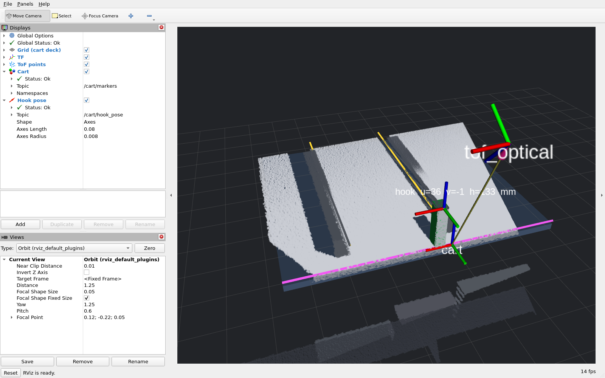

# ROS2 핸즈온 — 인식 노드를 직접 빌드·실행·확장하기

> 목적: JD 의 "ROS 기반 로봇 제어 및 시스템 통합", "ROS 아키텍처·노드·메시지 통신 이해"를 **직접 해 본 경험**으로 만들기.
> 1~5절은 따라 하면 된다. 6절의 제어 노드(`pick_executor`)는 구현되어 있으니 읽고 돌려 본 뒤 **6-b 의 변형을 직접 해 본다** — 그래야 면접에서 자기 말로 설명할 수 있다.
> 환경: Windows 11 + WSL2 Ubuntu 22.04 + ROS2 Humble. 설치는 `scripts/wsl_install_ros2.sh` (약 15분).

## 0. 이 패키지가 ROS 그래프에서 하는 일

```
 [source] ──▶ perception_node ──┬─▶ /tof/points            (PointCloud2)   ──▶ rviz2
  합성 | .mim 재생               ├─▶ /perception/boxes      (MarkerArray)   ──▶ rviz2
                                ├─▶ /perception/pick_poses (PoseArray)     ──▶ pick_executor (6절) ──▶ /robot/target_poses
                                ├─▶ /perception/next_pick  (PoseStamped)
                                ├─▶ /perception/status     (String JSON)
                                ├─▶ /diagnostics           (DiagnosticArray)
                                └─▶ TF static base_link → tof_optical
                                ◀── ~/capture (std_srvs/Trigger)  ◀── pick_executor · PLC/시퀀서 역할
```

1~5절은 이 인식 노드 하나만 쓴다. 6~8절에서 나머지를 붙이면 그래프가 아래처럼 된다 — 노드 6개, 두 갈래다.

```
 빈피킹  perception_node ─▶ /perception/pick_poses ─▶ pick_executor ─▶ /robot/target_poses ─▶ twin_bridge ─▶ MuJoCo 트윈 (TCP)
            ▲                                                                                      │
            └──── ~/capture ◀── (실행이 끝나면 다시 촬영) ◀── /robot/execution_result ◀───────────────┘

 대차    cart_node ─▶ /cart/hook_pose · 동적 TF tof_optical → cart ─▶ dock_node ─▶ /cmd_vel ─▶ agv_sim_node
            ▲                                                                                  │
            └──── ~/capture ◀── (AGV 가 멈추면 다시 촬영) ◀── /agv/rel_pose ◀─────────────────────┘
```

ROS2 개념이 어디에 쓰였는지: **노드**(위 6개), **퍼블리셔/토픽**(인식 노드만 7개), **서비스**(`~/capture` — 서버는 인식·대차 노드,
클라이언트는 제어·도킹 노드), **파라미터**(`source`, `rate_hz`, `min_confidence`, `temporal_prior` …), **TF**(카메라↔로봇 정적,
카메라↔대차 동적), **QoS**(포인트클라우드는 best-effort, 정적 TF 는 transient_local), **launch**(노드 + rviz2 동시 기동),
**패키지 빌드**(ament_python, colcon), **통합 테스트**(launch_testing).

## 1. 설치 (한 번만)

```powershell
# Windows PowerShell
wsl -d Ubuntu-22.04 -e bash /mnt/e/Robot_Sim/scripts/wsl_install_ros2.sh
```

끝에 `INSTALL_OK` 가 찍혀야 한다. 실패하면 `runs/ros2_install.log` 확인.

## 2. 빌드

```bash
# WSL 셸 (wsl -d Ubuntu-22.04)
source /opt/ros/humble/setup.bash
cd /mnt/e/Robot_Sim/ros2_ws
colcon build --symlink-install           # --symlink-install: 파이썬 소스 수정이 재빌드 없이 반영
source install/setup.bash
```

`~/.bashrc` 에 아래를 넣어 두면 매번 안 쳐도 된다. **WSL2 에서는 뒤의 두 줄이 없으면 노드끼리 통신이 안 된다**
(Fast DDS 공유메모리 전송이 `open_and_lock_file failed` 로 실패 — 이 레포에서 실제로 겪은 문제, `ros2_ws/fastdds_no_shm.xml` 로 UDP 만 사용):

```bash
source /opt/ros/humble/setup.bash
source /mnt/e/Robot_Sim/ros2_ws/install/setup.bash
export FASTRTPS_DEFAULT_PROFILES_FILE=/mnt/e/Robot_Sim/ros2_ws/fastdds_no_shm.xml
export RCUTILS_LOGGING_BUFFERED_STREAM=0    # 로그를 파일로 리다이렉트할 때 즉시 출력
```

**시계 점프 (이 머신에서 실제로 겪음)**: WSL2 의 실시간 시계가 **5초마다 +66 s / −66 s 로 튀었다**
(`time.time()` 0.1 s 샘플링으로 확인; 단조 시계 `CLOCK_MONOTONIC`/`BOOTTIME` 은 정상). 원인은 RTC 가 호스트 시각보다
65 s 앞서 있는 상태에서 `systemd-timesyncd` 와 WSL 호스트 동기화가 번갈아 시각을 밀었기 때문.
증상: rclpy 기본 타이머(시스템 시간 기반) 멈춤, `ros2 topic hz` 엉뚱한 값(4~5 Hz), 헤더 스탬프 역행.
```bash
sudo systemctl disable --now systemd-timesyncd   # 호스트 동기화만 남긴다 (재부팅 후 유지)
sudo hwclock -w                                  # RTC 를 시스템 시각에 맞춤
```
적용 후 12초 샘플에서 점프 0건. 노드 쪽 대책으로 주기 타이머는 단조 시계
(`create_timer(..., clock=Clock(clock_type=ClockType.STEADY_TIME))`)를 쓴다 — 실제 셀에서도 NTP 스텝 보정으로
같은 일이 생길 수 있으므로 옳은 설계다. 주기 검증은 벽시계가 아니라 `/proc/uptime` 으로 했다(0.5/1.0/2.0 Hz 설정 →
0.50/1.00/1.80 Hz, 2 Hz 는 프레임 처리 ~300 ms 에 묶임).

스크립트에서 노드를 **백그라운드로** 띄울 때는 `setsid ros2 run …` 로 세션을 분리할 것. 비대화형 셸의
백그라운드 잡으로 `ros2 run` 을 띄우면 타이머가 2프레임 뒤 멈추는 현상을 실측했다(setsid 시 정상).
터미널에서 포그라운드로 치거나 `ros2 launch` 를 쓰면 문제없다.

**잔류 노드 주의**: `setsid ros2 run …` 을 PID 로만 죽이면 런처만 죽고 그 아래 파이썬 노드는 살아남는다. 같은 `ROS_DOMAIN_ID` 로
다음에 띄운 rviz2 는 두 노드의 마커를 **합쳐서** 보여 주므로 라벨·색이 프레임과 안 맞는 화면이 나온다(실제로 10개가 쌓여 있었다).
정리는 프로세스 그룹째: `kill -- -$PID` (setsid 로 띄웠으면 PID = PGID). 확인/청소는 `pgrep -af 'perception_nod[e]'` 처럼
패턴을 자기 명령줄과 일치하지 않게 쓸 것 — `pkill -f perception_node` 는 그 문자열이 든 호출 셸까지 죽인다.
`ros2 node list` 에 같은 이름이 두 번 보이면 이 상황이다.

빌드 관련해서 겪은 것: 22.04 시스템 setuptools(59)는 편집 설치(PEP 660)를 못 해 `setuptools>=64,<80` 으로 올렸고
(<80 은 colcon-core 호환), colcon 이 pytest 러너를 고르려면 `setup.py` 의 `extras_require={"test": ["pytest"]}` 가
필요하다(`tests_require` 는 setuptools 72+ 에서 제거됨 — 없으면 `unittest` 로 빠져 "0 tests" 가 된다).

## 3. 실행하고 그래프를 눈으로 확인

터미널 A:
```bash
ros2 launch robotsim_perception_ros perception.launch.py rviz:=false
```

터미널 B — **여기서 배우는 것이 핵심이다.** 하나씩 쳐 보고 출력을 읽을 것:
```bash
ros2 node list                                   # 노드가 떠 있나
ros2 node info /robotsim_perception              # 이 노드의 퍼블리셔/서비스/파라미터 전부
ros2 topic list -t                               # 토픽과 타입
ros2 topic hz /tof/points                        # 주기 (rate_hz 파라미터와 같아야 함)
ros2 topic echo /perception/status --once        # 판정 JSON 한 줄
ros2 topic echo /perception/pick_poses --once    # base_link 좌표의 픽 포즈 (m)
ros2 interface show geometry_msgs/msg/PoseArray  # 메시지 정의를 직접 읽기
ros2 param list /robotsim_perception
ros2 param get /robotsim_perception min_confidence
ros2 run tf2_ros tf2_echo base_link tof_optical  # TF: 카메라가 로봇 베이스 기준 어디에 있나
rqt_graph                                        # 노드-토픽 그래프 그림 (WSLg 창)
```

트리거 모드(실제 셀의 PLC 신호 역할):
```bash
ros2 launch robotsim_perception_ros perception.launch.py rviz:=false rate_hz:=0.0
ros2 service call /robotsim_perception/capture std_srvs/srv/Trigger     # 다른 터미널에서
```

## 4. rviz2

```bash
ros2 launch robotsim_perception_ros perception.launch.py          # rviz 포함 (WSLg 로 창이 뜬다)
```

보이는 것: 회색 격자 = base_link 바닥, 축 = `tof_optical`(4.183 m 위), 포인트클라우드 = ToF 프레임,
초록 판 = 픽 계획에 든 박스(투명도 = 신뢰도), 주황 = 격자 보완 셀, 회색 = 저신뢰, 파란 화살표 = 다음 픽 접근.

실측 세션을 재생하려면 `source:=/mnt/h/…/img` (로컬 전용, 화면 캡처를 공개 레포에 올리지 말 것).

## 4-b. 실측 데이터 재생 결과 (로컬에서 실행한 기록)

`source:=<실측 세션 상위 폴더> loop:=false rate_hz:=2.0` 로 30프레임을 순서대로 흘렸을 때 노드 출력 요약
(세션 ID 는 생략, 캡처는 `explore/ros2/` 로컬 전용):

| 구간 | 상태 | 박스 수 | 비고 |
|---|---|---|---|
| 1층 디팔레타이징 12프레임 | OK ×12 | 12 → 1 | `/perception/pick_poses` 12 → 1개, 지연 260~377 ms |
| 티어시트 프레임 | LAYER_EMPTY | 0 | "층이 비었다"를 상위 제어기가 구분 가능 |
| 2층 디팔레타이징 13프레임 | OK ×13 | 12 → 1 | RGB 대조 167개와 합계 일치 (78 + 89) |
| 빈 팔레트 · 빈 크레이트 4프레임 | LAYER_EMPTY ×4 | 0 | 오검출 0 |
| 전 구간 | camera_drift OK | — | 고정 카메라 → 드리프트 없음 |

한 프레임(2층 12박스)의 `/perception/pick_poses`: `frame_id: base_link`, 12 포즈, 1번 픽 `(-0.512, -0.297, 0.923) m`
— z 0.923 = 카메라 높이 4.183 − 상면 깊이 3.257(m). TF `base_link → tof_optical` 이동 (0, 0, 4.183).

## 5. 테스트

```bash
colcon test --packages-select robotsim_perception_ros
colcon test-result --verbose
```

세 층이다 (colcon test 38건 + 트윈 서버가 있을 때만 도는 통합 테스트 1건):
- **메시지 변환** `robotsim_perception_ros/test/test_msgs.py`(빈피킹 6) · `test_cart_msgs.py`(대차 6): ROS 그래프 없이 합성 프레임으로.
  대차 쪽은 TF 왕복(카메라 좌표 고리 → TF → 대차 좌표 = `hook_cart_mm`)과 "카메라 높이·yaw 가 바뀌어도 대차 좌표 불변"을 검사한다.
- **판단 로직** `pick_executor/test/test_logic.py`(19) · `twin_bridge/test/test_bridge_logic.py`(4): 노드 없이 순수 파이썬.
- **통합(launch_testing)** `pick_executor/test/test_pick_cycle_launch.py` · `test_bag_replay_launch.py` · `test_twin_cycle_launch.py`(6-d) · `robotsim_perception_ros/test/test_dock_launch.py`(8-c):
  노드를 프로세스째 띄워 토픽·서비스 배선, 스탬프 짝 맞춤, Trigger 응답, 타이머까지 검사한다 — 단위 테스트가 못 보는 층이다.
  `launch_testing` 은 pytest 플러그인으로 등록되어 `colcon test` 가 그대로 돌린다(`@pytest.mark.launch_test` + `generate_test_description`).
  WSL2 에서는 노드끼리 UDP 로만 통신하도록 테스트 파일이 Fast DDS 프로필과 전용 `ROS_DOMAIN_ID`(71~73)를 환경에 넣는다 —
  같은 머신에서 도는 다른 데모와 섞이지 않게.

## 6. 인식 → 제어 → 재촬영 사이클 — `pick_executor` (구현되어 있음, 읽고 돌리고 바꿔 보기)

인식 노드가 낸 픽 포즈를 받아 "로봇에게 보낼 명령"을 만들고, 실행이 끝나면 인식 노드에 재촬영을 요청하는 노드다.
실제 셀에서 로봇 제어 노드가 하는 일의 뼈대이고, 패키지는 `ros2_ws/src/pick_executor/` 에 있다 (자세한 표는 그 안의 README).

```
 perception_node ──/perception/pick_poses (PoseArray)──▶ pick_executor ──▶ /robot/target_poses (PoseArray: pre-pick, pick, lift)
      ▲          ──/perception/status (String JSON)───▶      │          ──▶ /robot/trajectory   (MarkerArray, rviz 표시)
      │                                                       │          ──▶ /pick_executor/state (String JSON)
      └──────────── ~/capture (std_srvs/Trigger) ◀────────────┘  실행(execute_time_s) 뒤 서비스 호출
```

동작을 한 줄씩 풀면 이렇다.
1. 두 구독(`pick_poses`, `status`)은 한 프레임에 하나씩 오지만 도착 순서가 보장되지 않는다. 둘이 모이면 한 번 판단하고,
   같은 프레임인지는 스탬프로 맞춘다(인식 노드가 status JSON 에도 스탬프를 넣는다). 스탬프가 다르면 오래된 쪽을 버린다.
2. status 가 OK 가 아니면 명령을 내지 않고 WARN 로그만 남긴 뒤 잠시 후 재촬영한다. LAYER_EMPTY 가 **연속 3번**이면
   "집을 것이 없다"로 보고 종료(DONE)한다 — 한 프레임의 층 선택 실패로 멈추지 않게 하기 위해서다(`empty_retries` 2).
3. 로봇이 실행 중(EXECUTING)일 때 새 프레임이 오면 무시한다(busy). 움직이는 동안 목표를 바꾸면 안 된다.
4. 첫 포즈의 쿼터니언에서 툴 +Z 축(접근 방향)을 꺼내, pre-pick = pick 에서 접근 반대 방향으로 0.15 m, lift = 0.40 m 를 만든다.
   쿼터니언이 0 이면(자세 누락) 명령을 내지 않는다.
5. 직전에 보낸 pick 위치와 5 cm 안이면 같은 장면의 반복으로 보고 보내지 않는다(`min_dist_m`).
6. 실행은 `execute_time_s`(기본 2 초) 대기로 흉내 내고, 끝나면 `/robotsim_perception/capture` 서비스를 비동기로 호출해 다음 프레임을 받는다.
   요청 뒤 10 초 안에 판단이 없으면 감시 타이머가 오류를 남기고 다시 요청한다(메시지 유실 대비).

판단 로직은 `pick_executor/logic.py` 에 ROS 없이 순수 파이썬으로 있고(`test/test_logic.py` 19건, Windows 의 pytest 로도 돈다),
노드 파일은 메시지를 풀어 넘기고 결과를 메시지로 만드는 얇은 껍데기다. 이렇게 나누면 노드를 띄우지 않고도 판단을 검사할 수 있다.
검토에서 고친 것: rclpy 타이머는 주기적이라 새 타이머를 만들 때 이전 것을 cancel 하지 않으면 참조를 잃은 타이머가 영원히 울린다(고아 타이머).
그리고 인식 노드는 상태가 OK 가 아닌 프레임에도 Trigger 응답을 success=False 로 주는데, 이를 '촬영 실패'로 오해해 즉시 재촬영하면
타이머 재촬영과 겹쳐 사이클이 두 배로 돌았다 — 응답에 상태 JSON 이 들어 있으면 "프레임은 토픽으로 나갔다"로 보고 아무것도 하지 않게 했다.

### 6-a. 돌려 보기

```bash
ros2 launch pick_executor pick_cycle.launch.py          # 인식 노드(트리거 모드) + pick_executor + rviz2
# 다른 터미널
ros2 topic echo /robot/target_poses --once              # 3점이 base_link 좌표로 나온다
ros2 topic echo /pick_executor/state                    # {"state": "EXECUTING", "sent": 3, "skipped_duplicate": 0, ...}
rqt_graph                                               # 두 노드가 토픽·서비스로 이어진 그림
```

합성 장면(4×3 = 12박스)으로 돌린 기록(`scripts/wsl_pick_cycle_demo.sh`). 인식 노드는 `rate_hz:=0` 이라 스스로 프레임을 처리하지 않고
pick_executor 의 호출에만 반응한다. 집은 박스는 다음 프레임에서 사라진다(`synthetic_remove_picked`: 계획 1번 픽 박스 제거).
합성 박스는 반사 강도에 이음새가 없어 붙은 박스가 한 덩어리로 보이므로 첫 프레임의 12개는 직접 검출 4개 + 격자 보완 8개다.

| 시각 (기동 후) | 일어난 일 |
|---|---|
| 3.0 s | pick_executor 가 첫 촬영을 요청 |
| 3.5 s | 인식 노드가 12박스 프레임을 처리해 pick_poses 12개 + status OK 를 냄. pick_executor 가 1번 픽 (−0.453, −0.227, 1.213) m 에 대해 3점을 `/robot/target_poses` 로 냄 |
| 매 2.4 s | 실행 대기 2 초 → 재촬영 → 박스가 하나 준 프레임 → 다음 픽. 픽 #2 ~ #10 |
| 27 s, 29 s | 박스 2개가 남은 장면에서 인식 노드가 LAYER_EMPTY 를 두 번 냄(층 선택 실패). pick_executor 는 "layer empty (1/3), (2/3), retake" 로 재촬영만 하고 멈추지 않음 |
| 32 s, 34 s | 다음 두 프레임에서 검출기가 남은 2개를 다시 찾아 픽 #11, #12 |
| 36 s | 12개를 다 집어 합성 소스가 소진되고(Trigger 응답 "source exhausted") pick_executor 가 DONE 으로 종료. 보낸 명령 12, busy 0, 중복 0, 상태 불량 0 |

27~29 초의 두 번은 "박스가 몇 개 안 남으면 층 선택이 흔들린다"는 알려진 한계(docs/30)가 그대로 나타난 것이고, 그래서 제어 쪽에서
LAYER_EMPTY 한 번으로 끝내지 않고 세 번 연속일 때만 끝내도록 했다. 같은 장면을 오프라인으로 다시 돌려도 같은 자리에서 두 번 빈다.


*rviz 화면(기동 11 초, 픽 4개를 집은 뒤): 남은 박스 8개 가운데 초록 3개는 직접 검출, 주황 5개는 격자 규칙으로 채운 칸이다.
오른쪽 위 #0 박스 위의 노란 선이 pre-pick(파란 점) → pick(빨간 점) → lift(초록 점) 3점 궤적이고, `/robot/target_poses` 의 세 자세 중
lift(위)와 pre-pick(가운데) 축이 보이며 pick 자세의 축은 박스 판 아래에 가려 있다. 인식 노드의 마커와 pick_executor 의 마커가 같은
base_link 프레임에 그려진다.*



*rqt_graph(Nodes/Topics (active)): `/robotsim_perception` 이 `/perception/pick_poses`·`/perception/status`(와 rviz 용 `/perception/boxes`,
`/tof/points`)를 내고, `/pick_executor` 가 앞의 둘을 받아 `/robot/target_poses`·`/robot/trajectory` 를 낸다. 왼쪽 위 타원은 rviz2 의
TF 리스너 노드다. 서비스 호출(재촬영)은 rqt_graph 에 안 그려진다 — 토픽 그래프만 보여 주는 도구다.*

### 6-b. 직접 바꿔 볼 것 (이걸 해 봐야 "이해했다"고 말할 수 있다)

1. `execute_time_s:=0.5` 로 launch 해서 사이클이 빨라지는 것을 보고, `min_dist_m:=1.5` 로 올리면 왜 두 번째 픽부터 전부 "같은 장면"으로 걸러지는지 로그로 확인한다
   (팔레트 대각선이 약 1.0 m 라 1.0 으로는 모서리 박스 하나가 빠져나간다 — 그것도 직접 확인해 볼 것).
2. `logic.py` 의 `three_point_trajectory` 에 `retreat_m`(pick 뒤 옆으로 빼는 점)을 추가해 4점 궤적으로 바꾸고, `test_logic.py` 에 그 검사를 한 줄 넣어 통과시킨다.
3. `pick_executor_node.py` 의 `/perception/pick_poses` 구독 QoS 를 `BEST_EFFORT` 로 바꿔 본다(인식 노드는 reliable 로 낸다). 받아지는지, 반대로 `/tof/points`(best-effort 퍼블리셔)를 reliable 로 구독하면 왜 안 받아지는지 `ros2 topic info -v` 로 확인한다.
4. `ros2 param set /pick_executor min_dist_m 0.2` 를 실행 중에 쳐 본다. 값은 바뀌지만 동작이 안 바뀐다 — 노드가 파라미터를 시작할 때 한 번만 읽기 때문이다. `add_on_set_parameters_callback` 으로 실행 중 반영되게 고쳐 본다.

이 네 개를 하면 토픽·QoS·파라미터·서비스 클라이언트를 코드 수준에서 한 번씩 만져 본 것이 된다.

### 6-c. 트윈에 연결 — 로봇이 실제로 움직인다 (`twin_bridge`)

6-a 의 사이클은 실행을 2 초 타이머로 흉내 냈다. 여기서는 그 자리에 MuJoCo 셀 트윈(docs/41)을 넣는다: Windows 의 `tools/twin_server.py` 가
TCP 로 **프레임 요청**(카메라 역할)과 **3점 실행 명령**(로봇 역할)을 받고, WSL2 의 ROS2 그래프 셋이 그것을 쓴다.

```
 perception_node(source=twin://호스트:5555) ──/perception/pick_poses──▶ pick_executor ──/robot/target_poses──▶ twin_bridge ──TCP──▶ twin_server (UR10e+트랙)
        ▲  ~/capture (Trigger) ◀──────────────────────────────────────────┘  ▲                                   │
        │                                                                    └──/robot/execution_result (JSON)────┘ + /robot/tcp_path, TF base_link→tcp
        └───────────── 프레임 요청 ───────────────TCP──────────────────────────────────────────────────────────▶ 같은 twin_server
```

바뀐 것 셋.
1. **인식 소스** `twin://` — `sources.TwinSource` 가 프레임마다 트윈을 렌더해 받는다(X/Y/D/I float32, npz 압축 약 2 MB). 소스 팔레트가 비면
   (정답 기준 — 실제 셀의 '팔레트 비움' PLC 신호에 해당) 소진을 알린다. WSL2 에서 Windows 호스트는 기본 게이트웨이 주소다(`/proc/net/route`).
2. **pick_executor 의 완료 대기** `done_topic:=/robot/execution_result` — 타이머 대신 로봇(브리지)의 보고로 실행을 끝낸다(보고의 `cmd_stamp`
   가 보낸 명령의 스탬프와 다르면 무시). 박스 쪽 실패(도달 불가·충돌·흡착 실패·놓기 실패)로 보고된 pick 위치는 막아 두고(blocked) 다음
   프레임에서 다음 후보를 낸다. 안 그러면 인식 노드가 매 프레임 같은 1번 픽을 내고 실행기는 '같은 장면'으로 걸러 영원히 재촬영만 한다 —
   첫 연결 실행에서 실제로 그렇게 됐다. 전송·브리지 오류(`bridge_error`, `busy`)는 박스에 대한 정보가 아니므로 막지 않고 같은 명령을 다시 낸다.
   종착점 둘: 남은 후보가 전부 막히면 LAYER_EMPTY 와 같은 규칙으로 3회 뒤, 명령을 못 낸 프레임(RETAKE 등)이 12회 연속이면 DONE.
   인식 노드가 프레임을 못 받으면(트윈 서버 끊김) 노드는 죽지 않고 `SOURCE_ERROR` 를 돌려주고, 실행기는 잠시 뒤 다시 요청한다.
3. **twin_bridge** — `/robot/target_poses` 를 받아 트윈에 실행을 요청하고(작업 스레드; 노드는 계속 spin), 돌아온 TCP 경로를 시뮬 시각대로
   실시간 재생하며(`realtime_factor`) `/robot/tcp_path` 마커와 TF `base_link → tcp` 를 내고, 끝나면 `/robot/execution_result` 로 보고한다.
   실행 중에 온 명령이나 잘못된 명령도 `busy`/`bad_request` 로 바로 보고한다(안 내면 실행기가 타임아웃까지 기다린다).
   트윈은 시뮬 7.5 s 를 평균 0.87 s 에 계산하므로 재생 없이는 사이클이 실제보다 빨리 돈다. 결과에는 `pick_err_mm`(명령 픽 위치 vs 실제로 집은 박스
   상면 중심)이 들어 있다 — 인식 오차와 노드↔트윈 좌표 불일치가 여기 다 나타나므로, 좌표계가 맞는지는 이 값으로 확인한다.

돌려 보기 (Windows PowerShell 한 줄이 서버 기동 → WSL2 그래프 끝까지 → rviz 캡처 → 종료까지 한다):
```powershell
powershell -ExecutionPolicy Bypass -File scripts\twin_cycle_demo.ps1        # 산출물: assets/ros2_twin_cycle_rviz.png, explore/ros2/twin_cycle.log, explore/twin/twin_server.jsonl
python tools\twin_cycle_summary.py                                          # -> results/ros2_twin_cycle.json
```
손으로 하려면 Windows 에서 `.venv\Scripts\python.exe tools\twin_server.py --arm track --boxes 12 --seed 500`, WSL2 에서
`ros2 launch twin_bridge twin_cycle.launch.py` (rviz 포함; `rviz:=false realtime_factor:=0` 이면 최대 속도).

**기록 (12박스, UR10e + 트랙, 인식 노이즈 모델 켬, 층 선택 시간 사전 `temporal_prior:=true`)**

| 항목 | 값 | 뜻 |
|---|---|---|
| 프레임 / 명령 | 13 / 12 | 프레임마다 인식 → 첫 후보를 명령. 마지막 프레임은 빈 팔레트(소스 소진) |
| 배치 / 실패 | 12 / 0 | 트윈의 팔이 명령 12회를 전부 집어 목적지 3×3 격자(9 + 2층째 3)에 놓았다 |
| 남은 박스 | 0 | 사전 없이 돌리면 2개가 남았을 때 층 선택이 데크를 '상면'으로 골라 검출 0 → 3회 연속으로 종료했다(10/12). 직전 프레임 층 깊이를 사전으로 쓰면 끝까지 간다(docs/41 8절) |
| 프레임별 검출/정답 | 4/12, 4/11, 10/10, 4/9, 7/8, 6/7, 6/6, 5/5, 4/4, 3/3, 2/2, 1/1 | 박스가 많을 때 격자 보완이 못 채운 칸이 많고(첫 프레임 12 중 4), 6개 이하에서는 전부 찾는다. OK 프레임 리콜 평균 82% |
| 명령 픽 위치 vs 집은 박스 중심 (pick_err) | 중앙값 6.1 mm, 최대 88.7 mm | 인식 오차와 노드↔트윈 좌표 불일치가 합쳐진 값. 89 mm 는 격자 보완으로 채운 칸(직접 검출 아님)을 집은 경우 |
| 시뮬 사이클 | 평균 7.5 s (6.3~10.9) | 관절 속도 한계·직선 하강 0.4배 속도·흡착/해제 대기 포함 (docs/41 7절 C 의 7.9 s 와 같은 정의) |
| 계산 시간 | 실행 1회 평균 0.87 s(0.6~1.3), 렌더+인식 0.5 s | 트윈이 실시간보다 약 8.7배 빠르다 → 브리지가 재생으로 실시간에 맞춘다 |



*rviz 화면(세 번째 명령 실행 중): 초록·주황 판 = 인식 노드가 본 남은 박스(직접 검출 / 격자 보완), 왼쪽 위 박스 위의 노란 세 점 = 이번 명령의
pre-pick·pick·lift, 하늘색 선 = 트윈 팔 끝(TCP)이 지나온 경로(소스 → 목적지 → 후퇴), 주황 구 = 지금 TCP 위치(TF `tcp`). 오른쪽 위의 점구름
덩어리는 팔 받침대와 트랙이다 — 카메라에 팔이 보인다는 뜻이고, 그것이 층 선택에 영향을 준다(docs/41 7절 C).*

**첫 실행이 가르쳐 준 것.** 첫 연결 실행은 12박스 중 6개가 놓는 순간 튕겨 나갔다(놓은 위치 오차 0.2~26 m). 오프라인 폐루프에서 '운동학적
이송 아티팩트'로 적어 두었던 현상이 ROS 그래프로 구동하자 절반의 픽에서 재현됐고, 트윈 서버의 접촉 로그를 스텝 단위로 찍어 원인 셋을 갈랐다
— 픽 포즈 요 규약(minAreaRect 각도), 팔뚝이 든 박스를 관통하는 IK 해, 소스 박스와 1.6 mm 겹치는 목적지 슬롯. 전부 제어·평가 쪽 결함이고
고친 뒤 실패 0 이다(docs/41 7절 '놓기 실패의 원인 추적'). 그 밖에 rclpy 로거는 호출 지점(파일:줄)마다 심각도가 고정되어 같은 줄에서
`info`/`warn` 을 바꿔 부르면 `Logger severity cannot be changed between calls` 로 스레드가 죽는다 — cmd #4 의 결과 보고가 그렇게 유실됐다.
mujoco 렌더러(OpenGL 컨텍스트)는 만든 스레드에서만 쓸 수 있어서 서버는 소켓 스레드가 아니라 메인 스레드에서 요청을 처리한다.

**실제 셀과 다른 점.** 트윈 서버가 로봇 드라이버·센서 드라이버·PLC 신호를 한 프로세스에서 대신한다. 실제로는 MoveIt/제조사 드라이버의
액션 서버와 센서 SDK 노드가 그 자리에 오고 `twin_bridge` 는 없어진다. 바뀌지 않는 것은 pick_executor 쪽 — 완료 보고를 기다리고 실패한
후보를 막는 로직이다.

### 6-d. ros2 bag 기록·재생과 통합 테스트

인식 출력을 **기록해 두고 제어를 회귀 검사**하는 형태다. `scripts/wsl_bag_record.sh` 가 합성 12박스 사이클을 돌리며 두 bag 을 남긴다:

| bag | 토픽 | 크기 | 용도 |
|---|---|---|---|
| `explore/ros2/bags/pick_cycle_full` (로컬) | 점구름·마커·포즈·상태·명령·TF 전부 (133 메시지, 21 s) | 13 MB | `ros2 bag play` 로 rviz 재생 |
| `ros2_ws/src/pick_executor/test/data/pick_cycle_synth` (커밋) | `/perception/pick_poses` + `/perception/status` 14프레임 | 40 KB | `test_bag_replay_launch.py` 입력 |

`/tf_static` 은 transient_local 로 나오므로 기록기에 QoS 재정의(`test/data/tf_static_qos.yaml`)를 줘야 늦게 붙어도 받는다.
합성 프레임에서 나온 포즈·상태 JSON 뿐이라 작은 bag 은 공개 레포에 둘 수 있다. 실측 세션을 재생한 bag 은 회사 데이터라 커밋하지 않는다.

통합 테스트 셋:
1. `test_pick_cycle_launch.py` — 인식 노드(합성, 트리거 모드) + pick_executor 를 띄워 `/robot/target_poses` 12건(각 base_link 3점,
   pre-pick = pick + 0.15 m, lift = pick + 0.40 m)과 DONE(sent 12, busy 0)을 확인한다. 12 s.
2. `test_bag_replay_launch.py` — 작은 bag 을 `ros2 bag play --rate 2` 로 흘리고 pick_executor(타이머 모드)가 OK 프레임마다 명령 하나를
   내는지 본다. 기대 명령 수는 bag 의 status 메시지에서 직접 센다(12) — 기록이 바뀌어도 테스트가 따라간다. 17 s.
3. `test_twin_cycle_launch.py` — 트윈 서버가 떠 있을 때(`ROBOTSIM_TWIN_HOST=auto`) 인식·pick_executor·twin_bridge 셋으로 팔레트를 비운다.
   DONE, 명령마다 완료 보고(`robot_ok + robot_fail == sent`), 전송 오류 0, 배치 ≥ 8/12, 모든 보고에 `cmd_stamp`, 성공한 픽의 `pick_err_mm` < 100.
   기본 `colcon test` 에서는 건너뛴다(외부 프로세스 필요).

```bash
ros2 bag info ros2_ws/src/pick_executor/test/data/pick_cycle_synth
ros2 bag play explore/ros2/bags/pick_cycle_full --rate 2        # 다른 터미널에서 rviz2 -d …/pick_cycle.rviz 로 재생을 본다
ROBOTSIM_TWIN_HOST=auto python3 -m pytest ros2_ws/src/pick_executor/test/test_twin_cycle_launch.py -q   # Windows 에서 서버를 띄운 뒤
```

## 7. 이력서에 쓸 수 있는 것 / 없는 것

- 쓸 수 있음: WSL2 Linux 에 ROS2 Humble 환경 구축, ament_python 패키지 빌드, 노드·토픽·서비스·파라미터·TF·QoS·launch 사용,
  rviz2 시각화, 인식→제어 노드 간 메시지 통신과 서비스 클라이언트로 닫은 재촬영 사이클(6절 — 6-b 의 변형까지 직접 해 봤을 때 자기 말로 설명할 수 있다),
  시뮬레이터(MuJoCo 트윈)를 로봇 드라이버 자리에 물려 노드가 낸 명령을 실제로 실행시키고 완료 보고로 사이클을 닫은 것(6-c),
  launch_testing 으로 노드를 프로세스째 띄우는 통합 테스트와 ros2 bag 기록·재생 회귀 테스트(6-d),
  인식 출력(고리 포즈)으로 AGV 를 결합 위치까지 몰고 가는 도킹 폐루프 — 제어기·운동학 플랜트·stop-and-go 촬영 동기화(8-c),
  정적/동적 TF 를 용도에 맞게 나눈 좌표계 설계(8절)
- 쓸 수 없음: 실로봇 제어, 실센서 드라이버, 하드웨어 실시간성. 이 레포의 ROS2 는 시뮬·재생 데이터로만 돈다.

## 8. 대차(카트) 모드 — `cart_node`

빈피킹 노드는 "카메라가 팔레트를 수직으로 내려다본다"는 가정으로 정적 TF `base_link → tof_optical` 하나면 됐다.
대차 견인 고리 데이터는 다르다: 카메라가 데크를 **법선 대비 약 40° 비스듬히** 보고, 세션마다 카메라 높이(400~463 mm)와
대차 위치(21~52 mm 실이동)가 바뀐다. 그래서 좌표계를 카메라가 아니라 **대차 구조물**에서 매 프레임 추정한다
(`robotsim_perception/cart.py`, tools/hook_analysis_v2.py 의 이식 — 실측 4세션 파리티 0.01 mm 이내, `tests/test_real_cart.py`):

1. 데크 플레이트 평면 RANSAC + 2차면 잔차(ToF 워프) 정련 → 평면 좌표 (u, v, h)
2. 높이 밴드 [12, 150] mm 안의 '밝은' 성분 = 고리 벽 (레일·고리 윗면은 어둡다) → wall_top
3. 플레이트 림 라인(v' 원점, yaw) + 왼쪽 레일 안쪽 벽(u' 원점) → 대차 프레임  p_cart = R·p_cam + t

```
 [source] ──▶ cart_node ──┬─▶ /tof/points      PointCloud2   tof_optical
  synthetic_cart | .mim   ├─▶ /cart/hook_pose  PoseStamped   tof_optical  (위치 = 고리, 자세 = 대차 축 → 도킹 목표)
                          ├─▶ /cart/markers    MarkerArray   cart         (데크 판 · 림 · 레일 · 고리)
                          ├─▶ /cart/status     String JSON  · /diagnostics (림·레일 피팅 MAD, 카메라 높이)
                          └─▶ TF **동적**  tof_optical → cart   (프레임마다 R, t 재추정)
```

ROS 관점에서 배우는 것: **정적 TF 와 동적 TF 의 구분**. 카메라 설치 외참은 정적(`StaticTransformBroadcaster`, 한 번),
대차 프레임은 대상이 움직이므로 동적(`TransformBroadcaster`, 매 프레임 + 스탬프). rviz 는 마커 헤더의 `cart` 프레임을
TF 트리로 따라가 카메라 프레임 위에 그린다 — 마커를 카메라 좌표로 변환해 보낼 필요가 없다.

```bash
ros2 launch robotsim_perception_ros cart.launch.py                 # 합성 대차 장면 + rviz2
ros2 topic echo /cart/hook_pose --once                            # tof_optical 좌표의 고리 포즈 (m)
ros2 run tf2_ros tf2_echo tof_optical cart                        # 대차 프레임 원점(림 × 왼쪽 레일)이 카메라 기준 어디인가
ros2 topic echo /cart/status --once                               # hook_cart_mm, rim_yaw_deg, rail_gap_mm, latency_ms
ros2 topic echo /diagnostics --once                               # 피팅 품질을 운영 모니터가 읽는 형태
```

합성 소스는 프레임마다 카메라 높이(400/420/440/462 mm)와 대차 yaw(0/+4/−3/+2°)를 바꾼다. 로그에서
`hook_cart` 는 (36.1~36.6, −1.3~−1.7, 132) mm 로 고정되고 `camH`·`yaw` 만 변한다 — "카메라 좌표는 변해도 대차 좌표는 같다"가
이 노드가 보여 주려는 것이다(정답 (36, 0, 130); 합성 절대 정답 테스트 `tests/test_cart.py` 8건).

### 8-b. 실측 대차 4세션 재생 결과 (로컬에서 실행한 기록)

`source:=<대차 세션 상위 폴더> loop:=false rate_hz:=2.0`, 세션 ID 는 `results/hook_repeatability.json` 의 익명 이름:

| 세션 | 카메라 높이 | hook_cart (u', v', h) mm | 림 yaw | 지연 |
|---|---|---|---|---|
| frame_31 | 400 mm | (35.9, 1.6, 128.1) | −0.20° | 453 ms |
| frame_32 | 422 mm | (31.9, −3.5, 129.9) | −0.29° | 459 ms |
| frame_33 | 440 mm | (32.0, 1.4, 132.1) | −0.08° | 393 ms |
| frame_34 | 463 mm | (32.1, 3.5, 134.2) | −0.33° | 385 ms |

세션 간 카메라 높이가 63 mm, 대차 실이동이 최대 52 mm 인데 대차 프레임의 고리 u' 는 32~36 mm, v' 는 ±3.5 mm 안에 든다.
이 네 행의 3D RMS 는 **3.85 mm**(면내 3.1 mm) 로 `results/hook_repeatability.json` 의 `cart_frame` 모드와 같다(같은 알고리즘).
JSON 의 3.2 mm 는 이 구조 프레임을 초기값으로 기준 세션 데크에 ICP 정련한 `icp_deck` 모드이며, 세션 간 정합이라
프레임 단위 노드에는 넣지 않았다 — 처음 문서에 3.2 를 노드 수치로 적었던 것을 검토에서 바로잡았다.
h 가 128→134 로 카메라 높이에 따라 단조 증가하는 것은 JSON 에 기록된 시점 의존 바이어스(크라운 상단 에지)이며 여기서도 그대로 재현된다.
캡처는 `explore/ros2/rviz_cart_real.png`(로컬 전용), 공개용은 합성 장면 `assets/ros2_rviz_cart_synthetic.png`.

검토(합성 장면 sweep)에서 잡은 결함 두 건도 고쳤다: |yaw| > 5.7° 에서 림 창(+30 mm)에 잘린 먼 빈이 가짜 수평선을 만들어
yaw≈0·고리 v' 25~31 mm 오차를 **상태 OK 로** 내던 것(잘린 빈·이미지 경계 빈 제거 + 회전 좌표 2차 추출, `tests/test_cart.py`
yaw ±8° × 카메라 높이 7단 sweep 회귀 테스트), 그리고 창 안 강도가 균일하면 배경을 벽으로 잡아 예외로 죽던 것(상태 NO_HOOK 반환).

쓸 수 있는 말: "비스듬한 ToF 카메라에서 대차 구조물 기준 좌표계를 추정해 동적 TF 와 도킹 목표 포즈로 낸다, 4세션 3.85 mm RMS(면내 3.1)".
쓸 수 없는 말: 실제 AGV 도킹 제어, 카메라-차체 외참(핸드아이) 실측값, "3.2 mm" 를 노드 수치로 쓰는 것.

### 8-c. 대차 도킹 폐루프 — `dock_node` + `agv_sim_node`

cart_node 가 낸 고리 포즈를 **쓰는 쪽**이다. AGV(차동 구동, 운동학 시뮬)가 카메라로 본 고리를 향해 다가가 결합 위치
(고리가 카메라 발밑 앞 200 mm, 정면, 요 0)에 서는 폐루프를 ROS 노드 셋으로 닫았다. 판단은 `robotsim_perception/dock.py`(ROS 없이 pytest 10건).

```
 agv_sim_node ──/agv/rel_pose (JSON: hook_u, rim_v, yaw, moving)──▶ cart_node(source=synthetic_dock) ──/cart/status──▶ dock_node ──/cmd_vel (Twist)──▶ agv_sim_node
                                                                          ▲ ~/capture (Trigger) ◀── AGV 가 멈추면 촬영 요청 ──┘          └─▶ /dock/state (JSON)
```

- **좌표**: 데크 플레이트 평면 좌표(u 좌우, v 앞뒤, h 위; 카메라 발밑 원점)를 AGV 프레임으로 본다 — 플레이트가 바닥과 평행하니 실제 base_link 와
  축이 같고, 실제 시스템에서 카메라→base_link 외참 TF 가 하는 일을 여기서는 플레이트 평면 추정이 대신한다. 측정 = `hook_plane_mm`(u, v) + `rim_yaw_deg`.
- **플랜트**: `agv_sim_node` 가 /cmd_vel 을 적분해 상대 포즈(hook_u, rim_v, yaw)를 내고, cart_node 의 `synthetic_dock` 소스가 그 포즈로
  합성 대차 장면을 렌더한다 — AGV 가 움직이면 다음 프레임의 고리 위치가 바뀐다.
- **제어**: 대차 중심선(고리를 지나는 선) 위, AGV 발밑 투영점보다 150 mm 앞의 점을 pure pursuit(직선 추종은 선으로 수렴하며 방향도 맞춘다),
  전진 속도 ∝ 결합점까지 남은 거리(≤ 150 mm/s), 도착 뒤 제자리 요 정렬, 측방 오차가 남으면 200 mm 물러나 재접근.
- **stop-and-go**: 명령 하나를 0.5 s 적용하고 멈추면 dock_node 가 `~/capture` 를 불러 다음 프레임을 받는다. 연속 주행으로 돌렸더니 인식 지연
  (~0.45 s) + 묵은 명령 유지(~0.5 s)로 요가 −6 → −16 → −35 → −51° 로 발산했다(실측). 오프라인 시뮬에 지연을 넣어 확인하면 지연 2스텝에서는
  어떤 이득 조합도 60회 중 39회를 넘지 못했다 — 저속 도킹에서 측정을 정지 상태에서 하는 것이 답이다.

**평가 (`tools/cart_dock_sim.py`, 시작 30회: 측방 ±150 mm · 거리 290~500 mm · 요 ±8°, 노이즈 2.5 mm, 프레임 0.5 s, 최대 60스텝)**

| 구동 | 성공 | 평균 시간 | 최종 오차 (정답 기준, 평균) |
|---|---|---|---|
| 정답 측정(oracle) | 30/30 | 7.3 s | 측방 3.4 mm · 거리 7.1 mm · 요 1.19° |
| 인식 구동 | **27/30** (정답 기준 26) | 9.1 s | 측방 3.0 mm · 거리 6.8 mm · 요 1.23° (p95 측방 6.3·거리 9.7 mm) |

결합 판정은 제어기가 자기 측정으로 하고(|u| < 10 mm, |v + 200| < 10 mm — 결합 자리는 고리가 카메라 앞 200 mm 라 평면 좌표로 v = −200, |요| < 2°),
표의 오차는 정답 기준이라 인식 오차가 더해진 값이다. 그래서 제어기가 결합을 선언한 27회 중 정답으로 다시 재면 허용치 안에 든 것은 26회다. 고리 인식의 위치 오차가
~1 mm(합성)라 둘이 거의 같다. 인식 실패 프레임 74건: 합성 고리는 림 거리 500 mm 밖에서 검출되지 않는다(NO_HOOK) — 1차 평가에서
재접근 거리를 400 mm 로 두었더니 물러난 자리에서 고리가 안 보여 30회 중 12회가 멈춰 있었고, 재접근 거리를 200 mm 로 줄이고 측정 상실 시
잠시 기어가는 규칙을 넣어 고쳤다. ROS 폐루프(cart_node + dock_node + agv_sim_node, stop-and-go): 시작 측방 120 mm·거리 480 mm·요 −6° 에서 17프레임 만에 결합, 측정 오차 u 1.0 mm · v -8.7 mm · 요 -1.09°. 인식 지연 평균 426.2 ms.



*왼쪽: 인식 구동 30회의 궤적을 AGV 기준 고리 위치로 그린 것이다. 파란 점이 출발 자리, 별이 결합 위치, 붉은 궤적 3개가 실패한 회차다.
가운데: 결합 판정 시점의 실제 오차로 주황이 인식 구동, 파랑이 정답 측정이고 점선이 판정 허용치다. 오른쪽: 도킹에 걸린 시간이며
인식 구동의 16초 이상 세 회차가 고리를 놓쳐 다시 찾은 회차다.*



*rviz(고정 프레임 = 대차): 데크 판·림(자홍)·레일(노란)·고리(초록) 마커는 대차 프레임에 고정되어 있고, 오른쪽 위 `tof_optical` 축이 AGV 에 실린 카메라다.
도킹이 진행되면 이 축이 고리 앞 결합 위치로 다가온다.*

```bash
ros2 launch robotsim_perception_ros dock.launch.py                     # 시작 hook_u −80, rim_v −450, yaw 5°; rviz 포함
ros2 launch robotsim_perception_ros dock.launch.py init_hook_u_mm:=120.0 init_rim_v_mm:=-480.0 init_yaw_deg:=-6.0 rviz:=false
ros2 topic echo /dock/state            # {"mode": "follow", "errors": {"e_u": ..}, "docked": false}
python tools/cart_dock_sim.py --starts 30                              # 오프라인 평가 -> results/cart_dock.json, assets/cart_dock.png
```

실제와 다른 점: 플랜트가 운동학(관성·미끄러짐·바퀴 지연 없음)이고 카메라가 데크와 정확히 평행한 바닥 위에 있다. 합성 대차의 고리 검출 한계(500 mm)는
실측 4세션(카메라 높이 400~463 mm, 거리 285 mm 부근)에서 조정된 상수 때문이며, 먼 거리 접근에는 상수 재조정이 필요하다.
