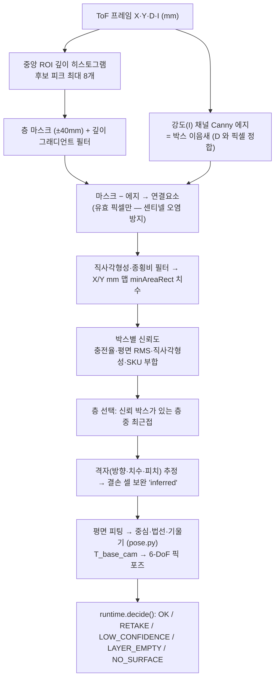
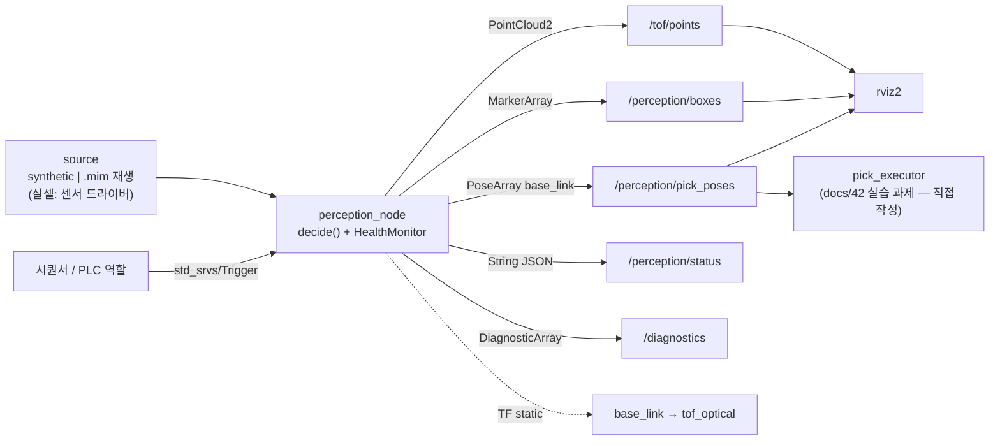
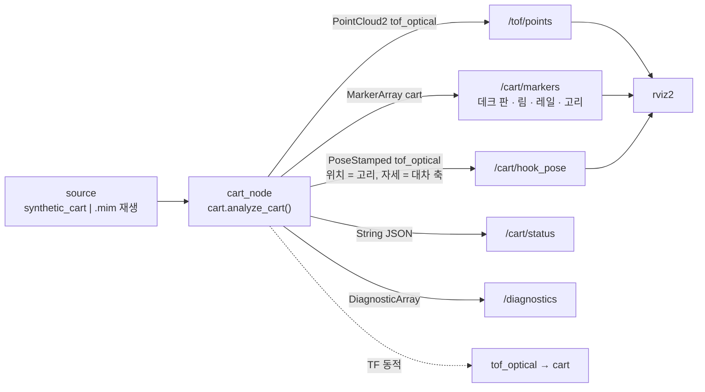

# 아키텍처

## 1. 한 장 요약

- 생성: `python tools/make_architecture_diagram.py` → `assets/architecture.svg` + `docs/diagrams/architecture.excalidraw`
  (같은 스펙에서 둘 다 생성하므로 어긋나지 않는다. 수치가 바뀌면 생성기의 텍스트만 고치고 재실행)
- 손으로 다듬으려면 `architecture.excalidraw` 를 [excalidraw.com](https://excalidraw.com) 에서 연다

## 2. 인식 파이프라인 (무학습 기하) — `robotsim_perception/geometry.py`

## 3. 좌표계

| 프레임 | 정의 | 어디서 |
|---|---|---|
| `tof_optical` | 카메라 광학. x 오른쪽, y 아래, z 전방(깊이). 실측 `.mim` 의 X/Y/D 와 동일 | `frame.py`, ROS `/tof/points` |
| `base_link` | 로봇 베이스. `T_base_cam`(4×4, mm)으로 변환. 기본값은 탑다운 설치 예시 (카메라 높이 4.183 m, R = diag(1,−1,−1)) | `pose.py`, ROS TF static |
| 트윈 월드 | MuJoCo. `ToF_X = world_X`, `ToF_Y = −world_Y`, `ToF_D = CAM_H − world_Z` | `sim/cell_twin.py` |
| `cart` (대차) | 대차 구조물 프레임. 원점 = 플레이트 림 라인 × 왼쪽 레일 안쪽 벽, u' 림 방향, v' 림에 수직(카메라 쪽 +), h 플레이트 법선. **프레임마다 재추정**, `tof_optical` 의 자식 동적 TF | `cart.py` `_cart_frame`, ROS `msgs.cart_transform` |

실제 `T_base_cam` 값은 핸드아이 캘리브레이션이 필요하다(하드웨어). 값이 틀리면 픽 포즈가 통째로 밀리므로
`runtime.HealthMonitor` 가 정적 배경 깊이 편차로 드리프트를 감시한다.

## 4. ROS2 그래프 — `ros2_ws/src/robotsim_perception_ros`

대차(카트) 모드는 별도 노드다. 카메라가 데크를 약 40° 비스듬히 보므로 탑다운 가정을 쓸 수 없고,
좌표계를 **대차 구조물(플레이트 평면 · 림 · 레일)** 에서 매 프레임 추정해 동적 TF 로 낸다:

