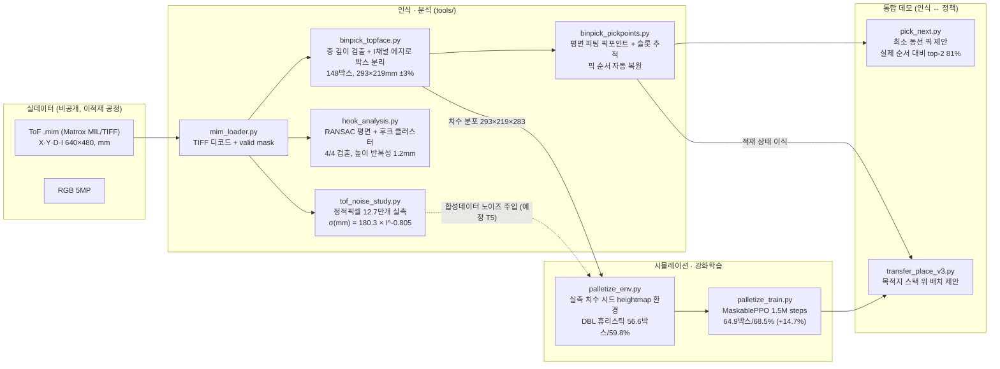
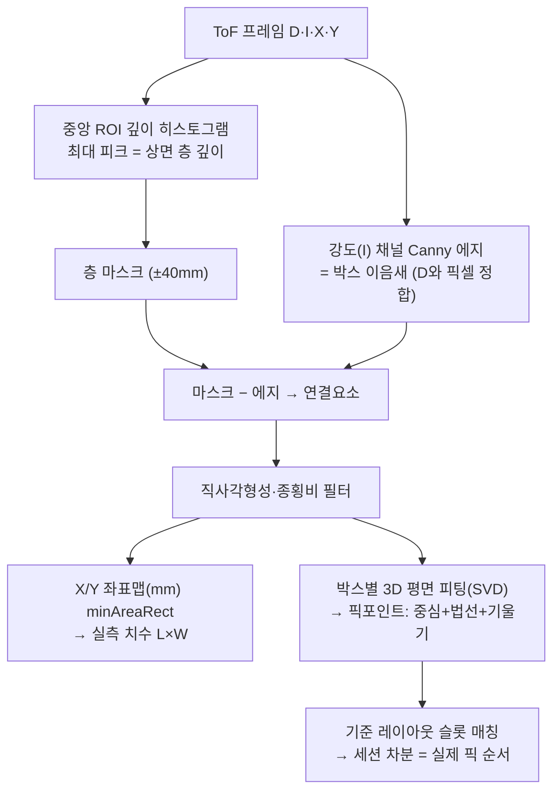
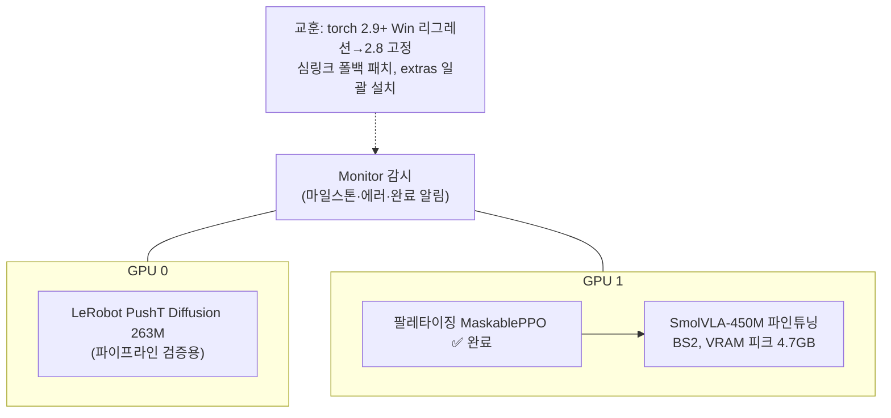

# 파이프라인 아키텍처

> GitHub이 Mermaid를 직접 렌더링합니다. 편집용 손그림 버전: [`diagrams/pipeline.excalidraw`](diagrams/pipeline.excalidraw) (excalidraw.com에서 열기)

## 1. 전체 맵 — 데이터에서 데모까지

## 2. 인식 파이프라인 상세 (무학습 기하)

## 3. 이적재 사이클 — 데이터로 복원·검증된 흐름

## 4. 학습 인프라 (RTX 3080 10GB ×2)

